# PoP Create

?> To access the navigable process click on the link:
[PoP-Create Business process](https://pop-blockchain.github.io/PoPCreate/BusinessArchitecture/index.html#list)

## Token Creator Application

### Business Process

### Token Creator

The macro process shows how the create token application works. There are two steps: 

- the **open area**, where the user defines the token and makes its registration; 

- the **logged area**, where the user defines the licenses, the payment method and manages the token.

The application also needs to manage the status of these licenses

<p align="center">
  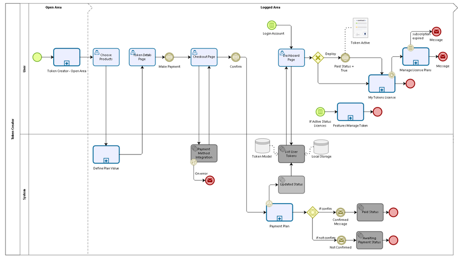
</p>

In the **open area** the user will define his token, a summary of the token to be created is displayed. After filling in the account registration information, a wallet is created and associated with that user registration.

<p align="center">
  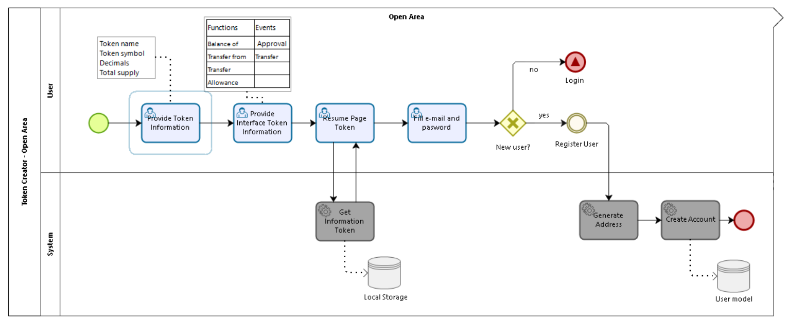
</p>

The setup fee is paid only when creating the token. The purchase of other products after the creation of the token does not include the value of the setup.

<p align="center">
  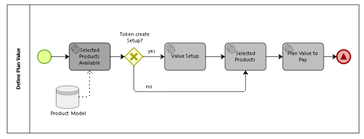
</p>

After confirmation of payment, the products selected for your plan are available for use.

<p align="center">
  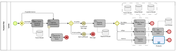
</p>

### Features to Manage Token

To manage the token, an application with the main features is available to the user. Currently it is possible to mint and burn the created token.

<p align="center">
  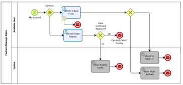
</p>

### Manage Licenses  by User

The user can manage his plan by canceling products or adding others at any time.
The cancellation checks the remaining usage time.

<p align="center">
  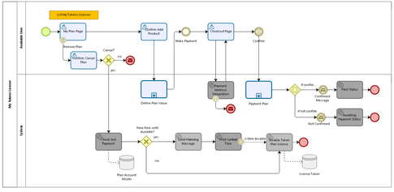
</p>

#### Plan Accounts Manager

The license management generates the recurring payment and checks whether the license is close to the expiration date to notify the token owner. If the license expires and there is no payment, it is canceled.

<p align="center">
  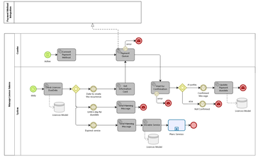
</p>

### Acceptance criteria

- **An account** can create **multiples tokens** contracts

- Each new account need generate an address to be a owner of the Tokens

- User need fill with e-mail and password to create an account

- Encrypted storage of generated wallet information

- User does not receive private key and mneumonic

- The token symbol need to be unique in the environment

- Create Token smart contracts **ERC-20** standard Ethereum Token, mintable and burnable, Ownable and Pausable

- User buy licences to use the avaliable products

- User need to pay a setup value once

- Each new token need to be a subscribe to a service. Is for token and not for account.

- Deploy only to the mainnet

- Internationalization (PT-BR and English)

- Status to create a Token:

| Status | Description |
| ------ | ----------- |
| Wainting for Payment | Pending confirmation of license payment. |
| Paid | After confirmation of license payment |
| Deployed | After user makes the token deploy. |

### Interface to create and manage Token

- Open area:
    - Form with infos about token creation

| Field | Description |
| ----- | ----------- |
| Token Name | String (3 - 25 symbols. Alphanumerical characters, space, and hyphen are accepted.) |
| Token Symbol | String (3-4 letters and need to be unique) |
| Decimals | Integer (0 - 18 integer) |
| Type | Value PoP-20 |
| Total suply | Integer |

- Logged area
    - Manage token application

| Menu | Description |
| ---- | ----------- |
| Menu Dashboard | Card with Information about created token (with details created token) |
| Menu My Plan | Show information about the contracted license |
| Payment Details | List the payment details for each token. |
| My Tokens | List all my created tokens |
| Menu Mint / Burn | Enabled after the token is in active status, user can mint/burn to token created |

### Draft Pages

<p align="center">
  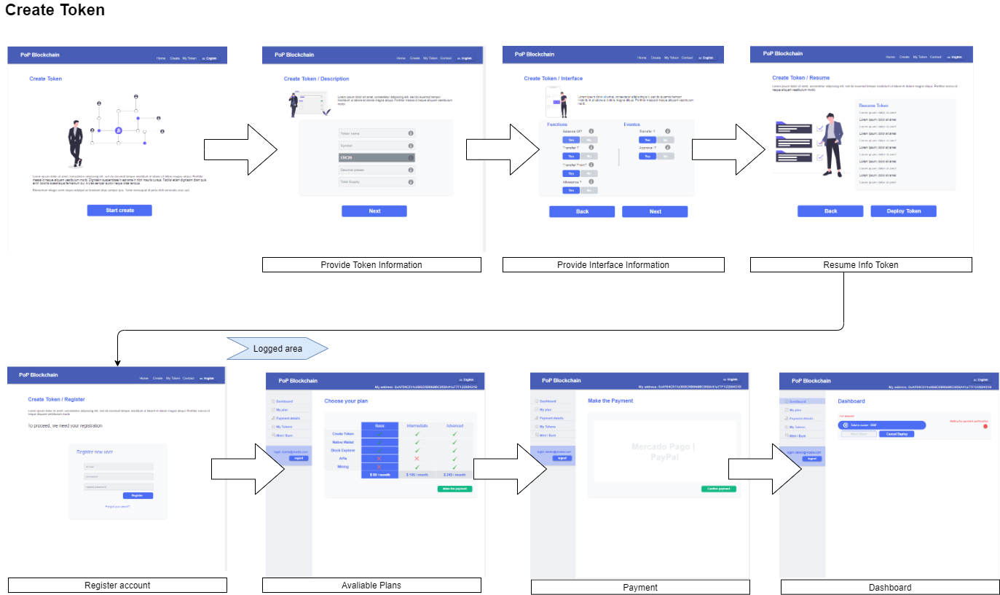
</p>

<p align="center">
  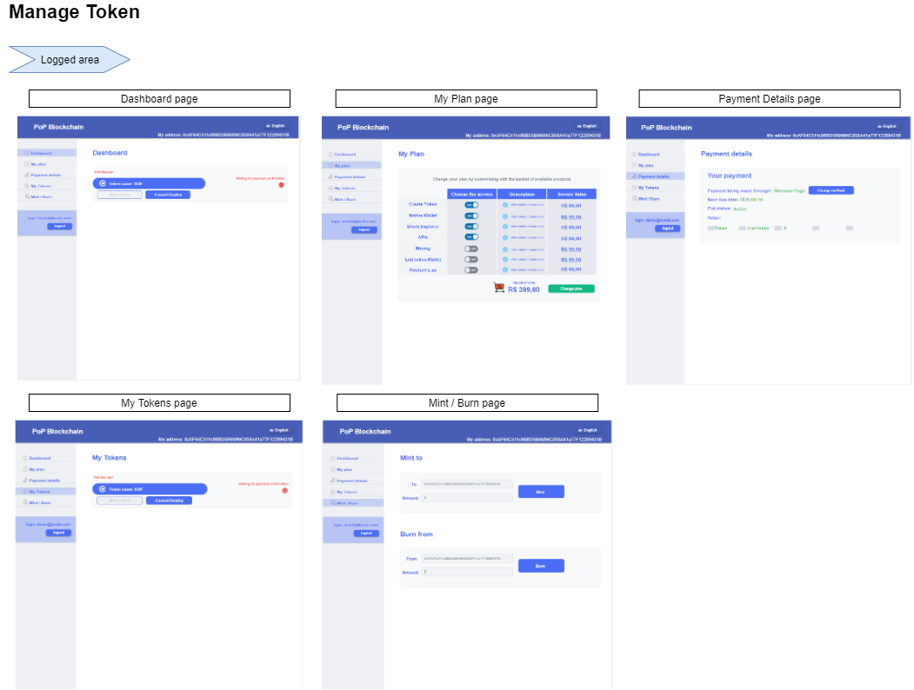
</p>

### How it Works

Create your Token without code and in a few steps.

<p align="center">
  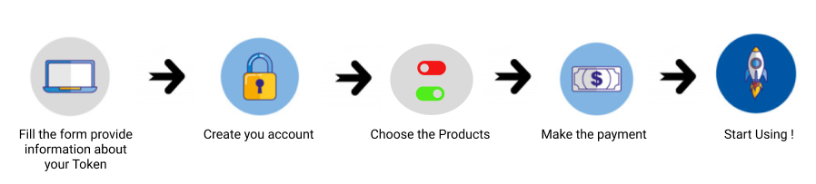
</p>

1. With an intuitive form you provide information about the token you want to create: name, symbol, number of decimal places and the total suply. All information has a clear explanation.

2. You create your account. Whith this account you can manage your Token easily with a intuitive interface.

3. Make the payment. Afther payment confirmation we made deploy 

4. Then start to use

### Process Steps

#### Start Create Token

If you want to generate your own token, we have created a tool that will enable you to deploy your own token in a few minutes, without coding skills. You only needs define the name and symbol of the token, as well as initial supply.

#### Step1 - Provide Token Information

- Fill the form with information about your Token:
    - **Name** -> the name of your token, it is important to give an identity. 3-25 symbols. Alphanumerical characters, space, and hyphen are accepted.
    - **Symbol** -> the symbol represents your brand, it is usually 3-4 letters and need to be unique
    - **Type** -> PoP-20 is a proposed and widely adopted standard for creating tokens. It's a set of rules implemented in a smart contract that is deployed on the PoP network
    - **Decimal places** -> The divisibility will help us determine the lowest possible value of the token.
A divisibility of 0 will mean that the lowest value of the token is 1.
A divisibility of 2, on the other hand, means its lowest value will be 0.01.
The maximum number of decimal places allowed is 18.
    - **Total supply** -> Number of tokens that will exist in the created ecosystem. This amount can be changed according to market needs, and can be increased or decreased (from the Mint and Burn functions respectively)

#### Step2 - Provide Interface Information

- The choice of functions defines how your token will work.
All created smart contracts are  **POP-20** standard Token, mintable and burnable, with owner access permissions and module pausable.

With this Token you can generate more tokens to increse the Total Supply of your token.

| Function | Description | Default PoP-20 |
| -------- | ----------- | -------------- |
| Transfer | Transfers amount of tokens from the caller’s account to recipient. | yes |
| Allowance (approve, increase and decrease) | Checks the limit that an address_spender (approved by the token owner) can spend from _owner. | yes |
| Transfer from | Moves amount tokens from sender to recipient. | yes |
| Balance of | Show the amount of tokens owned by your account | yes |

- **Events** are important because they facilitate communication between smart contracts and their user interfaces.

| Event | Description | Default PoP-20 |
| ----- | ----------- | -------------- |
| Transfer | Emitted when value tokens are moved from one account (from) to another (to). | yes |
| Approval | Emitted when the allowance of a spender for an owner is set by a call to approve. | yes |

#### Step3 - Resume Token

- A summary is displayed with the selected information of the token that will be created. It is possible to return and change if necessary.

#### Step4 - Register new account

- To access the token management functionality and the other benefits offered, it is necessary to create an account.

#### Step5 - Choose the plan
- We provide the best management and control tools for your token in each available plan.

#### Step6 - Make the payment

- Choose your payment method

### Feature

```gherkin
Feature: Create Token
    As a user I want to fill a form and then use my new token.

Scenario: Verify if description form is empty
    Given I am at create-token-description page
    When I click <next> button
    And the field Name filled with <Name>
    And the field Symbol filled with <Symbol>
    And the field Decimal filled with <Decimal>
    And the field Total Supply filled with <totalSupply>
    Then I should see a <message>

|Name         | Symbol   | Decimal | type   | totalSupply | message                  |
|empty        | "TKN"    | 18      | POP-20 | 0           | Field needs to be filled |
|"Token Name" | empty    | 18      | POP-20 | 0           | Field needs to be filled |
|"Token Name" | "TKN"    | empty   | POP-20 | 0           | Field needs to be filled |
|"Token Name" | "TKN"    | 18      | POP-20 | empty       | Field needs to be filled |

Scenario: verify if all itens are selectable 
    Given I am at create-token-interface page
    And all itens <itens> enabled
    When I check an enabled item <itens>
    Then this must be desable

Scenario: verify return data token
    Given I filled the form to create token
    When I access create-token-resume page
    Then I see all the information about the token

@register_User
Background: I am at create-token-register page

Scenario: Register user with invalid e-mail
    Given I fill the field e-mail with <email>
    And I fill the field password with <password>
    And I fill the field Confirm password with <confirmPassword>
    When I click Register button
    Then I can't proceed

Scenario: Register user with invalid password
    Given I fill the field e-mail with <email>
    And I fill the field password with <password>
    And I fill the field Confirm password with <confirmPassword>
    When I click Register button
    Then I can't proceed
|email          | password  |confirmPassword|
|xpto.gmail.    | 123456789 |123456789      |
|xpto@gmail.com | 123456789 |123456         |


@payment_method 
    Given context
    When event
    Then outcome   

```

```gherkin
Feature: Managment Token

    As I am a token owner I want to a easy experience to manage my token

@token_features

Background: logged in Token Creator application
    Given I am login page Token Creator application
    When I fill my <username>
    And my <password>
    Then I am at dashboard page

Scenario: Mint token
    Given I click mint button
    And I fill field "Address to" with <addressTo>
    And the field "Amount" with <amount>
    When I click mint button
    Then Then I see a message <message>

Scenario: Burn token
    Given I click burn button
    And I fill field "Address from" with <addressFrom>
    And the field "Amount" with <amount>
    When I click burn button
    Then I see a message <message>

Scenario: Cancel Deploy
    Given my created token has "Wainting for Deploy" status
    When I click cancel deploy button
    Then I see a message <message>

Scenario: Change the token plan
    Given I click change plan button
    When I am at my plan page
    And change my current plan
    Then I click make the payment button
    And I see payment page

Scenario: Access payment Details
    Given I need to know about my token plan
    When I select payment details at menu itens
    Then I see a list of my tokens and details plan

```

## Token Creator database
|      |      |
| ---- | ---- |
| mongo-express | Web-based MongoDB admin interface |
| mongo | MongoDB document databases |

This schemas defines the shape of the documents on Mongo collection:

<p align="center">
  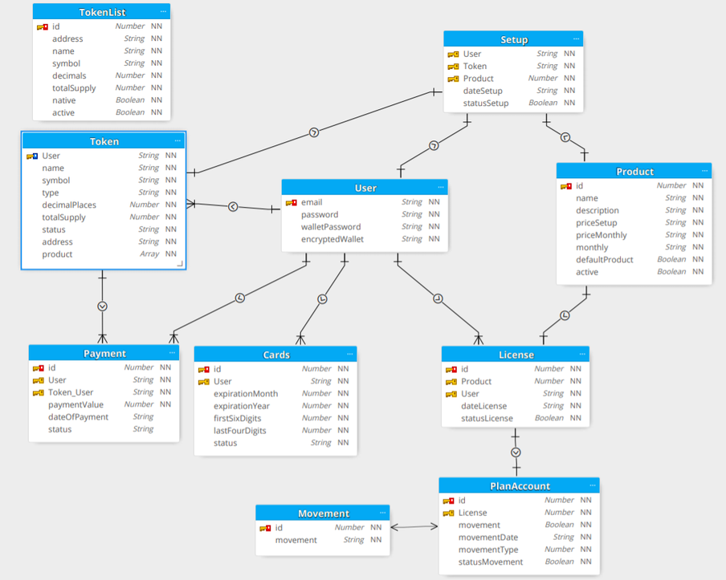
</p>

#### User Schema

| Property | Type | Description |
| -------- | ---- | ----------- |
| email | String | Used as id by user. |
| password | String | Created by the user when creating the account. |
| walletPassword | String | Created by the user when creating the account. |
| encryptedWallet | String | Wallet created for the user encrypted. |

#### Token Schema

| Property | Type | Description |
| -------- | ---- | ----------- |
| UserId | String | Used as id by user. |
| name | String | Token name. |
| symbol | String | Token Symbol |
| type | String | Token type to be created. enun:['ERC20'] |
| decimalPlaces | Number | Token number of decimal places, 1 to 18. |
| totalSupply | Number | Token quantity to be created (mint to addressOwner) when deploying the smart contract. |
| status | String | enun: ['awaitingPayment', 'deployed'] default: awaitingPayment |
| address | String | Address that was created and associated for the user. default: 0x00 |
| product | array | Lists the products that are considered standard when creating a token. default: [1,2,3] |

#### Product Schema

| Property | Type | Description |
| -------- | ---- | ----------- |
| Id | Number | Product id. |
| name | String | Product name. |
| description | String | Product description. |
| priceSetup | String | The value of the product setup. |
| priceMonthly | String | The value of the product monthly. |
| monthly | String | |
| defaultProduct | Boolean | Define if is a default token product. default: false |
| active | Boolean | Define if the product is active. default: true |

#### Setup Schema

| Property | Type | Description |
| -------- | ---- | ----------- |
| UserId | String | Used as id by user. |
| productId | Number | The setup products acquired by the user at the time of creating the token. |
| dateSetup | String | Setup payment date. |
| statusSetup | Boolean | default: true |

#### License Schema

| Property | Type | Description |
| -------- | ---- | ----------- |
| UserId | String | Used as id by user. |
| productId | Number | The setup products acquired by the user at the time of creating the token. |
| dateSetup | String | Setup payment date. |
| statusSetup | Boolean | default: true |

#### Plan Account Schema

| Property | Type | Description |
| -------- | ---- | ----------- |
| id | Number | Plan account id |
| licenseId | Number | The license id related to the account plan. |
| movement | Boolean | default: false |
| movementDate | String | |
| movementType | Number | |
| statusMovement | Boolean | default: true |

#### Payment Schema

| Property | Type | Description |
| -------- | ---- | ----------- |
| id | Number | Payment identifier. |
| userId | String | Used as id by user. |
| idToken | Number | The payment-related token. |
| paymentValue | Number | The payment value. |
| dateOfPayment | String | The payment date. |
| status | String | Field updated as payment confirmation. enum: ['awaitingPayment', 'paid'] default: 'awaitingPayment' |

#### Movement Schema

| Property | Type | Description |
| -------- | ---- | ----------- |
| id | Number | Movement identifier. |
| movement | String | Type of movement (cancellation, chargeback, debit, credit) |

#### Cards

| Property | Type | Description |
| -------- | ---- | ----------- |
| id | Number | Id of the card information related to the user. |
| userId | String | Used as id by user. |
| expirationMonth | Number | Card expiration month. |
| expirationYear | Number | Card expiration year. |
| firstSixDigits | Number | Card digits. |
| lastFourDigits | Number | Card digits. |
| status | String | |

#### Token List Schema

| Property | Type | Description |
| -------- | ---- | ----------- |
| id | Number | List token id. |
| address | String | Token smart contract address. |
| name | String | Token name. | 
| symbol | String | Token symbol. |
| type | String | Token type to be created. enun:['ERC20'] |
| decimalPlaces | Number | Token number of decimal places, 1 to 18. |
| totalSupply | Number | Token quantity to be created (mint to addressOwner) when deploying the smart contract. |
| native | Boolean | default: false |
| active | Boolean | default: true |

## Payment Management Licenses - Token Creator

#### Business Process

After payment confirmation, the user's token enters the management of the purchased licenses.

<p align="center">
  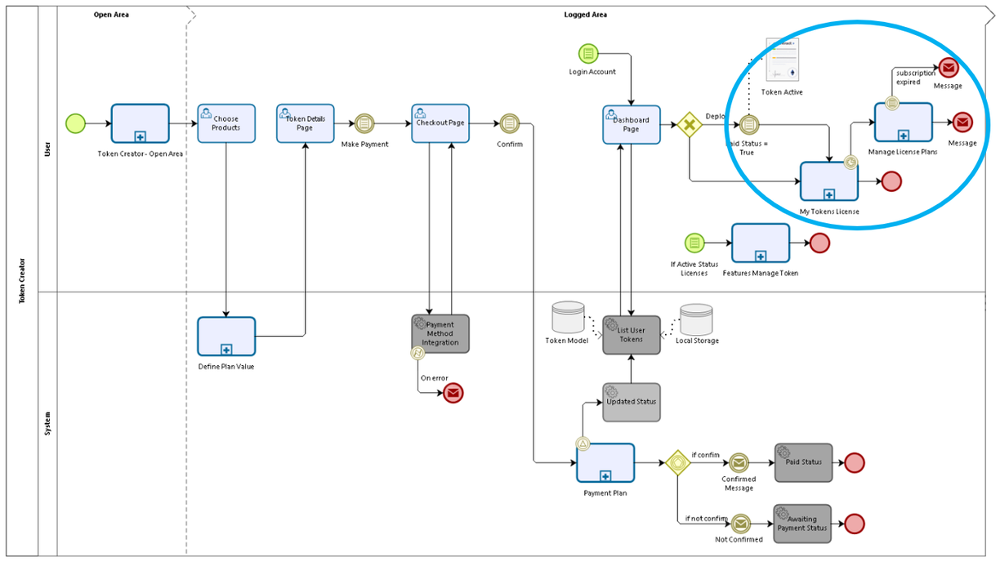
</p>

The user has control over the licenses purchased for his token. At any time it is possible to add more services or remove. It is at the discretion of the administrator of the Token Creator tool the price conditions of the services offered.

<p align="center">
  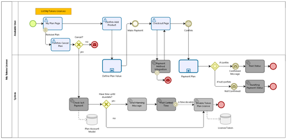
</p>

The Token Creator tool manages license payments daily. Checks payments received and licenses to expire by notifying the user. 

Licenses are prepaid, so Token Creator recalculates the cancellation date to the most appropriate day for the entire paid period to be used.

## Admin Token Creator

### Acceptance criteria

- Backoffice CRUD application to manage Token Creator exceptions

- Only one administrator user pre-registered in the Administrator token factory database

- Administrator database separate from the Token Factory application

- Log of actions in the Token factory Administrator database

- Backoffice application makes it possible:
    - Create, Update and delete Users
    - Create, Update and delete Tokens
    - Create, Update and delete Payments
    - Create, Update and delete Plans
    - Create, Update and delete Token Listed

### How it works

Token Creator administrator is pre-registered in the database

- The administrator accesses the backoffice application and selects a menu item that need works.

- Each record in the list has an action buttons

#### Interface to manage Users

- Lists users registered in the Token Creator Application.

- Add new user **requires** create a wallet.

- Create new user send a e-mail to define password.

- The user's identifier is his email, this field **can not** be updated. 

- Password field can be updated.

- Reset password send a e-mail to a user to define new password

- Removing the user deletes the user's record from the database.

<p align="center">
  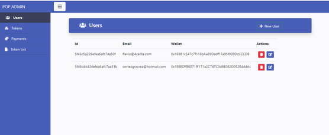
</p>

#### Interface to manage Tokens

- Lists all registered Tokens in the Token Creator Application.

- To add a new token, the user's email is required. It must be a valid email as a existing user Id 

- If the status of the token is equal to **deployed** it is not possible to change the informations: Symbol, Token Name, Decimals Place, and Total supply

- For now the only token type is ERC-20, so the type field is not updated.

- <mark>Check if can update User Id and address</mark>

- Delete action only removes the Token from the database.

<p align="center">
  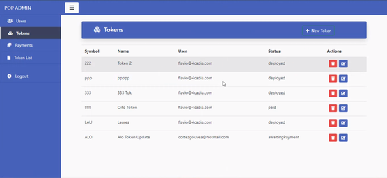
</p>

#### Interface to manage Payments

- Lists all registered Tokens Payments in the Token Creator Application.

- Create a new payment need integration with payment method. Select the token name in the field and the system fills the remaining fields.

- Can update the field date of payment and the value.

- The status field checks whether the token is: Awaiting Payment, Paid and Deployed.

- Delete action removes a payment from the database and make monitoring impossible.

<p align="center">
  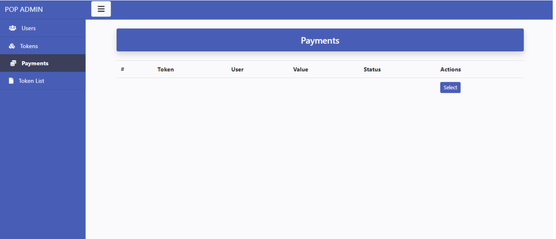
</p>

#### Interface to manage Token List

- Lists all registered Tokens in the token list of the Token Creator Application.

- To add new token to the list, select the token name or the token symbol in the field and the system fills the remaining fields.

- Update the token information: address, name, symbol, decimals, totalSupply, the new registered token is displayed in the list token service.

- Field native: if it is set to native = true, it is considered a token that will be created whenever someone creates a wallet, they are tokens that do not need the paid service of list tokens.

- Field status: if the status is active = true, it is displayed in the wallet list

- Delete action removes the token from the service list token. Will no longer appear in the wallet.

<p align="center">
  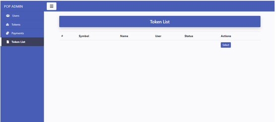
</p>

#### Interface to manage Plan

- Lists all registered Plans in the Token Creator Application.

- Create a new active plan will be displayed in the list of plans to be purchased by the user.

- Can update the fields: description, price, monthly, defaultProduct, active

- Delete action removes the plan from the database.

### Features

?> In order to I need to change certain Token Creator records
As a token creator administrator I want a backoffice module

#### Login application

```gherkin
Feature: Login application
    As a token creator administrator I need to login in application

    Scenario: Login with a valid password
        Given I am at login page
        When I fill the field "user"
        And I fill the field "password" with a valid <password>
        Then I can see home page application

    Scenario: Login with a invalid password
        Given I am at login page
        When I fill the field "user"
        And I fill the field "password" with a invalid <password>
        Then I can see a warning <message>
```

#### Module User

```gherkin
Feature: Add User
    As a token creator administrator I need to add new user

    Scenario: Add user with invalid e-mail
        Given I am at User page list
        When I click "add user"
        And I fill a invalid <email>
        Then I can see a warning <message>
        And I can not proceed
    Examples:
        | email     | message                  |
        | xpto.com  | Must be a valid e-mail.  |

    Scenario: Add user existing user e-mail
        Given I am at User page list
        When I click "add user"
        And I fill a valid <email> 
        And I fill a <password>
        And I click "save" button
        Then I can see a warning <message>
        And I can not proceed

    Scenario: Add user with valid e-mail
        Given I am at User page list
        When I click "add user"
        And I fill a valid <email> 
        And I fill a <password>
        And I click "save" button
        Then I can see a success <message>
        And I can see new user in the User page list

    Scenario: system add user
        Given System recives a "save" command
        When check if <email> is unique
        Then user is registred
        And a message is send to a user

Feature: Reset User password
    As a token creator administrator I need to reset password to a user

    Scenario: Update password user
        Given I am at User page list
        When I click reset icon of a selected user
        Then I can see a success <message>
        And user recives a message to change <password>

Feature: Remove User from the database
    As a token creator administrator I need to remove the user 
    
    Scenario: Delete selected user
        Given I am at User page list
        When I click remove icon of a selected user
        And I see a confirm modal
        Then I choose "confimed" button
        And I can see a success <message>
    

```

#### Module Token

```gherkin
Feature: Add new token
    In order to I need to create tokens 
    As a administrator I want create a new token

    Scenario: Add token with invalid e-mail
        Given I am at token page list
        When I click "new token"
        And I fill a invalid <email>
        Then I can see a warning <message>
        And I can not proceed
    Examples:
        | email     | message                  |
        | xpto.com  | Must be a valid e-mail.  |

    Scenario: Add token with a not exist user e-mail
        Given I am at token page list
        When I click "new token"
        And I fill a valid <email> 
        Then system verify that is a not exist user e-mail id
        And I can see a warning <message>
        And I can not proceed

    Scenario: Add token without filling any fields
        Given I am at token page list
        When I click "new token"
        And I fill a valid <email>
        Then system verify that is a exist user e-mail id 
        And I dont fill a <tokenName>
        And I dont fill a <tokenSymbol>
        And I dont fill a <tokenDecimal>
        And I dont fill a <tokenTotalSupply>
        And I dont select a <status>
        Then I can not click "save" button
        And I can not proceed

    Scenario: Add token with a existing user e-mail
        Given I am at token page list
        When I click "new token"
        And I fill a valid <email>
        Then system verify that is a exist user e-mail id 
        And I fill a <tokenName>
        And I fill a <tokenSymbol>
        And I fill a <tokenDecimal>
        And I fill a <tokenTotalSupply>
        And I select a <status>
        Then I can click "save" button
        And I can see a success <message>
        And I can see new token in a token page list

    Scenario: add token with paid status
        Given I am at token page list
        When I click "new token"
        And I fill a valid and exists <email>
        And I fill all <fields>
        And the status field is equal "paid"
        Then system create an payment instance
        And I can see a success <message>
        And I can see new token in a token page listv

    Scenario: system add token
        Given System recives a <email> field information
        When check if the <email> exists
        Then check if all fields are filled
        And token is registred
        And I can see a success <message>

```

#### Module Payment 

```gherkin
Feature: Create payment
    In order to I need to create payments tokens out of application
    As a administrator I want create payments

    Background: access form payment
        Given I am at Payment page list
        When I click "add new" payment
        Then I see a form to fill

    Scenario: payment with a not exist user e-mail id
        Given I fill <email> with a not exist user e-mail id
        When I choose another field
        Then I can see a warning <message>
        And I can not proceed
   
    Scenario: payment with a not exist token id
        Given I fill <tokenId> with a not exist token id
        When I choose another field
        Then I can see a warning <message>
        And I can not proceed 

    Scenario: payment with some empty field
        Given I fill dont fill some field
        When try to save the payment
        Then I can see a warning <message> 

Feature: Update payment
    In order to I need to update payments tokens out of application
    As a administrator I want update payments

    Background: access form payment
        Given I am at Payment page list
        When I click update icon
        Then I see a form to update

    Scenario: payment with a not exist user e-mail id
        Given I fill <email> with a not exist user e-mail id
        When I choose another field
        Then I can see a warning <message>
        And I can not proceed
   
    Scenario: payment with a not exist token id
        Given I fill <tokenId> with a not exist token id
        When I choose another field
        Then I can see a warning <message>
        And I can not proceed 

    Scenario: payment with some empty field
        Given I fill dont fill some field
        When try to save the payment
        Then I can see a warning <message> 

Feature: Delete Payment
    In order to I need to remove payments tokens out of application
    As a administrator I want delete payments

    Scenario: Remove Payment
        Given I am at Payment page list
        When I click remove icon
        And I see a confirm modal
        Then I choose "confimed" button
        And I can see a success <message>
        And the Payment no longer appears to the user

```

#### Module Token List

```gherkin
Feature: Add new token to the token list
    In order to I need to add a token to the token list out of application
    As a administrator I want to be able to add tokens to the token list

    Background: Access token list information
        Given I am at the token list page
        When i click "add new" button
        Then I can see form to fill

     Scenario: token list with a not exist token name
        Given I fill <tokenName> with a not exist token name
        When I choose another field
        Then I can see a warning <message>
        And I can not proceed 

Feature: Update Token at the token list
    In order to I need to update a token to the token list out of application
    As a administrator I want to be able to update tje token list

    Background: Access token list information
        Given I am at the token list page
        When i click update icon
        Then I can see form to fill

     Scenario: token list with a not exist token name
        Given I fill <tokenName> with a not exist token name
        When I choose another field
        Then I can see a warning <message>
        And I can not proceed     

Feature: Delete token from the token list
    In order to I need to delete a token from the token list out of application
    As a administrator I want to be able remove tokens from token list

    Scenario: Remove token from the token list
        Given I am at token list page
        When I click remove icon
        And I see a confirm modal
        Then I choose "confimed" button
        And I can see a success <message>
        And the token no longer appears to the token list
        And loose the position

```

#### Module Plan

```gherkin


```

## Plan Services

## List Token Multi-asset wallet

### Token List Service

<p align="center">
  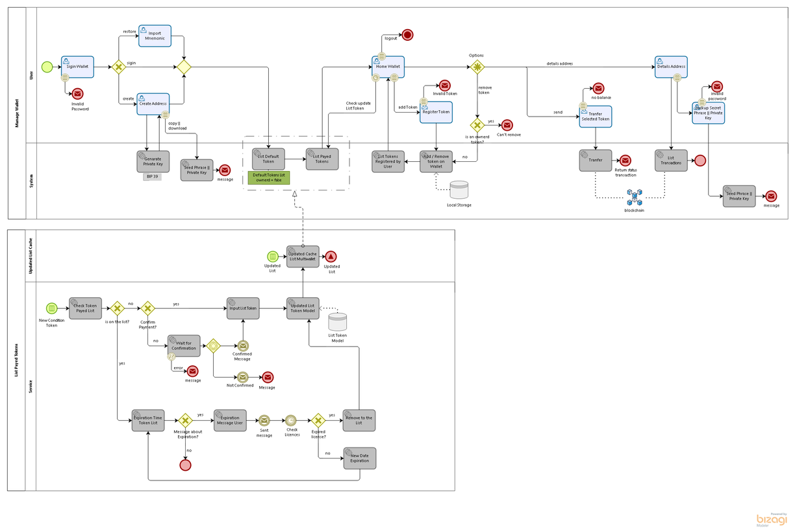
</p>

The multiwallet displays the list in the sequence listed below:

- Default tokens are displayed first

- Second is displayed the ownered tokens in order of license acquisition.

- Third tokens added manually by the user

The service warns the user that their license is about to expire.

If the renewal does not happen, the token is removed from the list, losing its position.

### Activate and Desable Plan Service

First, it is necessary to create a token in the Token creator and select the license to list the token in the multwallet.

The service of listing the token in the multiwallet can be purchased when creating a token or for users who already have the token it is possible to add the service at My Plan page.

<p align="center">
  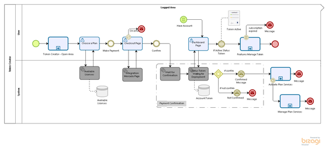
</p>

Activate Plan Services and Manage Plan Services describes application rules and the services used to create and manage the token licences.

<p align="center">
  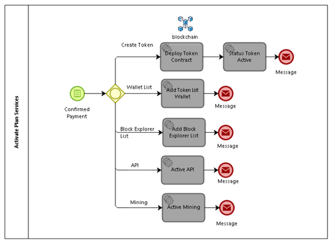
  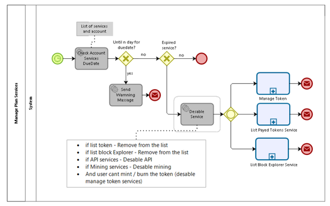
</p>

### Acceptance criteria 

- user can choose a payed service that lists his token in the existing multiwallets and the ones that are created

- is a payed service, before expiration, it message warns that it will expire and the token is removed from the list of all wallets

- if the service is not renewed on time, the token loses its position, is removed from the list.

- each token created needs a listing service

- list Tokens is order by: default tokens first, license acquisition order by id number  then  added manually by the user

### How it works

- When creating the token, the user chooses the service

- After payment confirmation the token is included in a list that is displayed for all wallets

- Near duedate the token owner receives a message to renew the token list service.

- Tokens that do not have the renewed service are removed from the list, and losing their position on the list.

<p align="center">
  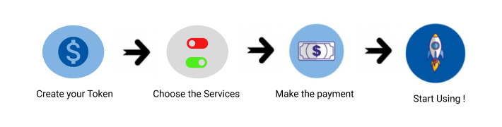
</p>

### Appications Changes:

#### Token Creator page choose plan

- Change the plan table to toggle buttons services

- When a button is on, the value is added to the total.

- Put a simple explanation of the service

- After payment confirmation the token is added to the list.

Draft page:
<p align="center">
  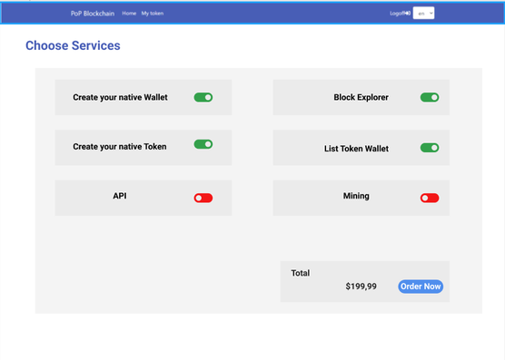
</p>

#### Wallet multi-assest dashboard

- The list is displayed on the wallet dashboard

- Ownered tokens cannot be removed from the list by the user

- Default tokens are displayed first

- Second is displayed the ownered tokens in order of license acquisition.

- Third tokens added manually by the user

Draft page:
<p align="center">
  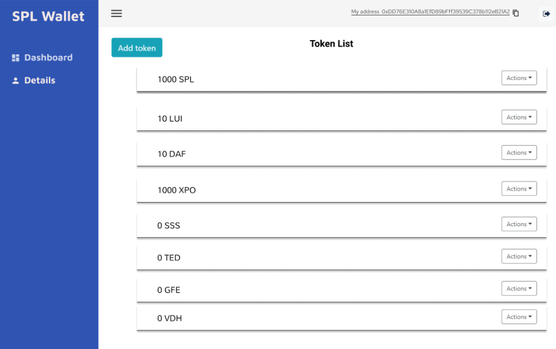
</p>

### API services

| Methods | Input Parameters | Output Parameter | Description |
| ------- | ---------------- | ---------------- | ----------- |
| addTokenList | token list model | return  true for new token added | The token is added to the list after payment confirmation |
| removeTokenList | token address | return true for removed token | It is removed from the token list if the payment is no longer active or if it is canceled by the user. |
| getTokenList | | return listed token order by first native = true | Returns the list of tokens. |

### Token List Model

| Property | Type | Required |
| -------- | ---- | -------- |
| id | number | |
| address | String | true |
| name | String | true |
| symbol | String | true |
| decimals | Number | true |
| totalSupply | Number | true |
| native | Boolean (default: false) | true |