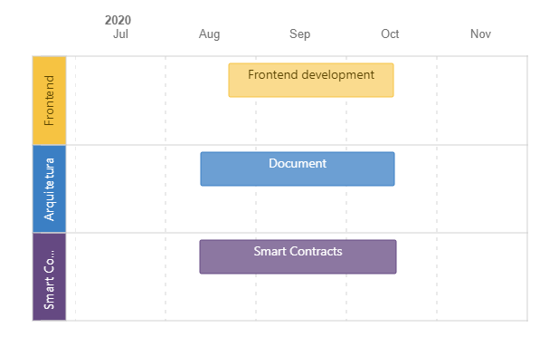
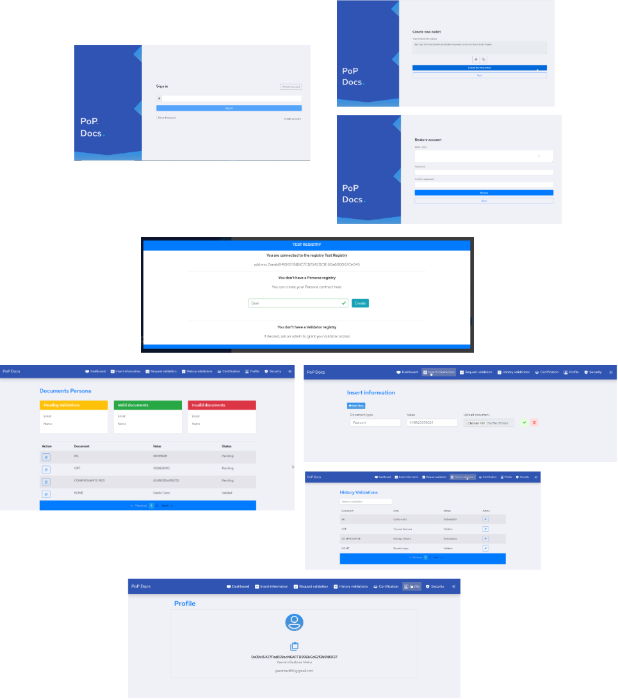

# Product Requirements - PoP Docs

## Objective

Developed using blockchain technology and smart contracts a decentralized digital document validation solution that offers the user complete control of their data.

This Persona will send your information and document to a Validator.

A Validator is registered and authorized to perform this function in the application, is selected by Persona to be able to validate your information.

This Validator, approved by an administrator, validates Persona's information.

The sending of documents and information needs to be done in a secure way, access to information is only from Persona and the Validator that Persona defines to validate the information. 

The certified module creates and stores this more informal type of document that does not need regulation and recognition of a specific organ.

?> To access the navigable process click on the link:
[PoP-Docs Business process](https://pop-blockchain.github.io/PoPDocs/BusinessArchitecture/index.html#list)

## Ecosystem Roles

| Role | Description |
| ---- | ----------- |
| Persona | The user who creates an account, add a nickname to create a Persona smart contract. |
| Validator | The user who creates an account and has approved by Register admin to be a validator. |

## Milestones

  

## Requirements

| Requirement | User Story |
| ----------- | ---------- |
| [Create Account](UserStories/CreateAccount.md) | As a user I want to create an account to use PoP Docs and keep my documents safe. |
| [Restore Account](UserStories/CreateAccount.md) | As a user who already has an account I want to be able to recover my account to use PoP Docs and keep my documents safe. |
| [Create Persona](UserStories/CreatePersona.md) | As a user I want to create my Persona to add my information and documents. |
| [Add Information](UserStories/AddInformation.md) | As a Persona I want to add my information and documents to be able to validate them |
| Validate Information | As a validator I want to access an application to validate the information sent to me. |
| Access profile information | As a PoP Docs user I want to access my profile information in the application. |
| Certifications | As Persona I want to create and receive certificates |

## User interaction and design
### Screen Drafts

  

