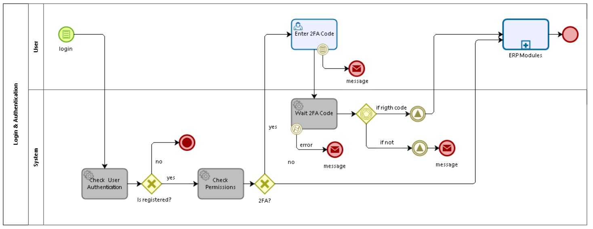

# **POP ERP**

## Product requirements 

<strong>Objective</strong>

Sistema integrado de gestão das atividades comerciais de uma empresa, tais como: movimentação de estoque, clientes, documentos, funcionários, impostos, produtos, serviços.
 

O sistema terá controle de acesso aos módulos com base em roles.
 
 
Cada empresa (cliente) terá uma instância de banco de dados dedicada, sendo a aplicação capaz de realizar conexões a múltiplos bancos de dados diferentes ao mesmo tempo.

A principal vantagem deste modelo é o isolamento “físico”, isolando o impacto das operações de cada empresa

  

O sistema também possui um mecanismo de criação de benefícios com a distribuição de tokens utilizando a tecnologia blockchain.

<strong>Requirements</strong>

| Feature | User Story | Status   |
| ---------- |:------------:| :------------:|
| Login         | Como um usuário cadastrado quero fazer o login na aplicação.           | <mark style="background-color:aquamarine;color:green;font-weight: bold;">Done</mark>            | 
| Login com 2FA         | Como um usuário cadastrado quero fazer o login na aplicação com segurança.            | <mark style="background-color:aquamarine;color:green;font-weight: bold;">Done</mark>            | 
| Recuperação e Alteraçao de  senha       | Como um usuário cadastrado quero recuperar minha senha ou alterar caso necessário.           | <mark style="background-color:aquamarine;color:green;font-weight: bold;">Done</mark>            | 
| [Cadastrar usuário](user-stories/cadastrar-usuario.md)       | Como admin da aplicação quero cadastrar novos usuários.           | <mark style="background-color:aquamarine;color:green;font-weight: bold;">Done</mark>            | 
| Cadastrar funcionário       | Como admin da aplicação quero cadastrar os funcionários da empresa.           | <mark style="background-color:gainsboro;color:grey;font-weight: bold;">To Do</mark>            | 
| Cadastrar roles       | Como admim da aplicação quero definir os níveis de acesso dos usuários na aplicação.           | <mark style="background-color:gainsboro;color:grey;font-weight: bold;">To Do</mark>            | 
| [Cadastrar produtos](/user-stories/cadastrar-produto.md)       | Como gestor do estoque quero cadastrar os novos produtos.           | <mark style="background-color:aquamarine;color:green;font-weight: bold;">Done</mark>            | 
| [Cadastrar marca](/user-stories/cadastrar-marca.md)       | Como gestor do estoque quero cadastrar as marcas dos produtos.           | <mark style="background-color:aquamarine;color:green;font-weight: bold;">Done</mark>            | 
| [Cadastrar cliente](user-stories/cadastrar-cliente.md)        | Como um usuário cadastrado quero recuperar minha senha ou alterar caso necessário.           | <mark style="background-color:aquamarine;color:green;font-weight: bold;">Done</mark>            | 
| Cadastrar categorias e subcategoria       | Como gestor do estoque quero relacionar os produtos por grupos e categorias.           | <mark style="background-color:aquamarine;color:green;font-weight: bold;">Done</mark>            | 
| Importar produtos em lote       | Como gestor do estoque quero cadastrar os produtos de uma forma dinâmica.           | <mark style="background-color:gainsboro;color:grey;font-weight: bold;">To Do</mark>            | 
| [Cadastrar loja](user-stories/cadastrar-loja.md)        | Como admin quero  cadastrar filiais de loja diferentes para controlar a mercadoria do estoque.           | <mark style="background-color:aquamarine;color:green;font-weight: bold;">Done</mark>            | 
| Ajustar Estoque       | Como gestor do estoque quero registrar as movimentações dos produtos no estoque.           | <mark style="background-color:aquamarine;color:green;font-weight: bold;">Done</mark>            | 
| Cadastrar Variação de Produto       | Como gestor do estoque quero criar a lista de variações de produtos.          | <mark style="background-color:gainsboro;color:grey;font-weight: bold;">To Do</mark>            | 
| Emitir etiqueta de produto      | Como estoquista quero emitir as etiquetas dos produtos do estoque.           | <mark style="background-color:gainsboro;color:grey;font-weight: bold;">To Do</mark>            | 
| [Cadastrar Fornecedor](/user-stories/cadastrar-fornecedores.md)       | Como gestor do estoque quero cadastrar os fornecedores dos produtos que vendemos.           | <mark style="background-color:aquamarine;color:green;font-weight: bold;">Done</mark>            | 
| Cadastro de conta bancária       | Como usuário do financeiro quero cadastrar as contas bancárias do estabelecimento.           | <mark style="background-color:aquamarine;color:green;font-weight: bold;">Done</mark>            | 
| Cadastrar Notas fiscais       | Como admin quero controlar a parte fiscal da empresa com um cadastro de Notas fiscais.           | <mark style="background-color:DeepSkyBlue;color:blue;font-weight: bold;">In Progress</mark>            | 

<strong>User interaction and design</strong>

> **Visitar o link:** https://cloud.protopie.io/p/95bab1bdff

## Protótipos Aplicação

?> **Visitar o link:** https://cloud.protopie.io/p/95bab1bdff

  
  
  
  

---

## Business Architecture

?> Para acessar o processo navegável clique no link:
[PoP-ERP Business process](https://pop-blockchain.github.io/PoPERP/BusinessArchitecture/index.html#list)

<strong>Cadastro de Usuário</strong>

O administrador da aplicação que possui a permissão para cadastrar um usuário no sistema.

Após o usuário cadastrado o sistema envia um e-mail para que o novo usuário definir a sua senha de acesso.

Também é possível definir a loja que esse usuário pertence e a permissão do mesmo na aplicação por meio de roles.

  

<strong>Definição de senha</strong>

Com o link o usuário é direcionado para uma página de definição de senha.

Após a confirmação da senha o usuário já pode fazer o login na aplicação.

  

<strong>Login na aplicação</strong>

Para fazer o login na aplicação é necessário já estar cadastrado.

O sistema verifica a permissão do usuário conforme o nível de acesso definido no cadastro.

Se o usuário optou pelo 2FA, é exibida a tela para verificação do código.

  

<strong>Recuperação de Acesso</strong>

Se o usuário precisar recuperar o acesso na aplicação pode solicitar o reset da senha para o e-mail cadastrado.

É enviado um e-mail para fazer o reset da senha.

  

<strong>Configuração de segurança - 2FA
</strong>

Uma opção de maior segurança para o uauário é configurar o 2FA.

O usuário pode fazer isso diretamente no sistema.

  

<strong>Módulo Vendas</strong>

Planejado para tratar uma venda desde a criação e registro de seus produtos no estoque atá o registro da saída desses produtos e criação de movimentação financeira para administrar o fluxo de caixa.

  

---

## User Stories

| User Story | User Story |
|:------------:|:------------:|
| [Cadastrar Usuário](user-stories/cadastrar-usuario.md) | [Cadastrar Marca](user-stories/cadastrar-marca.md) |
| [Cadastrar Cliente](user-stories/cadastrar-cliente.md)  | [Cadastrar Fornecedores](user-stories/cadastrar-fornecedores.md) |
| [Cadastrar Loja](user-stories/cadastrar-loja.md)  | [Cadastrar Produto](user-stories/cadastrar-produto.md) |