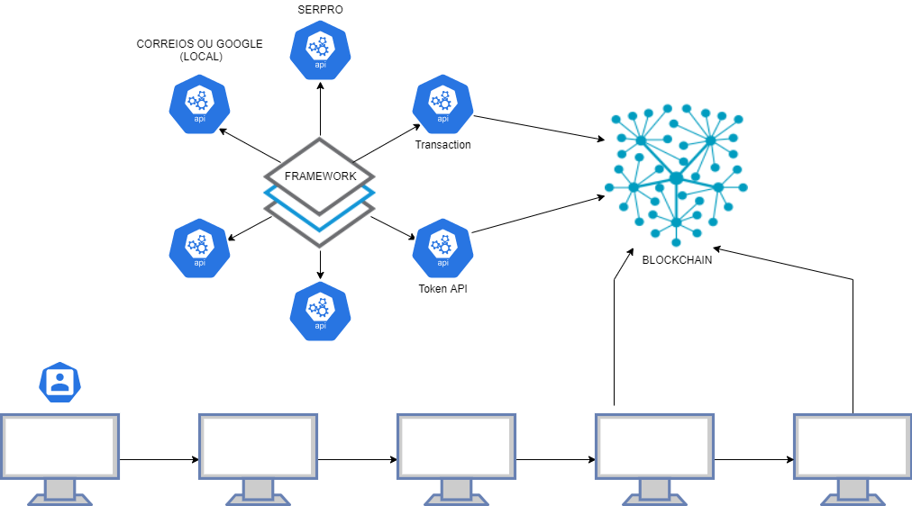
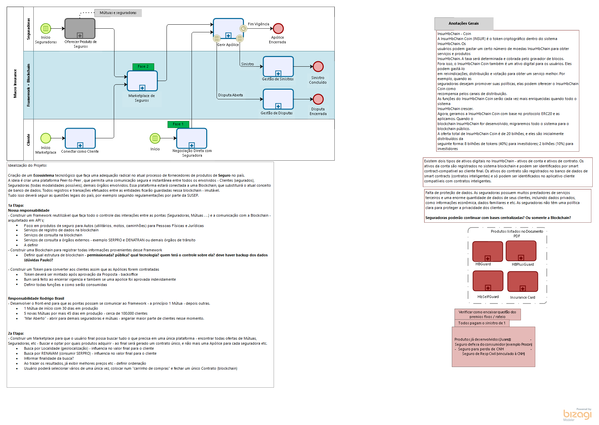
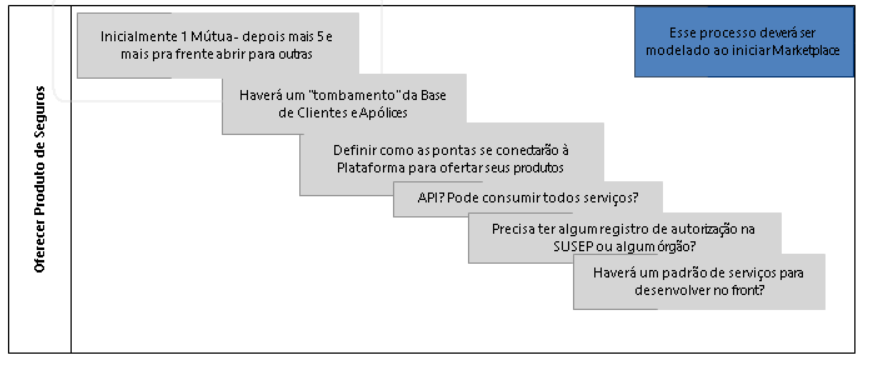
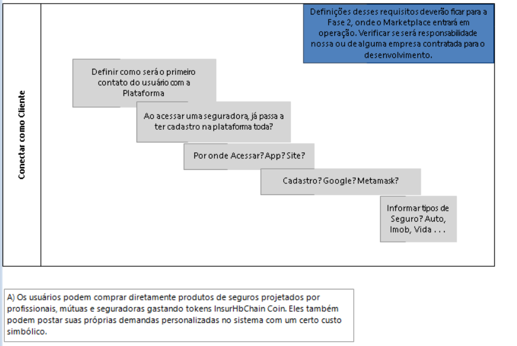
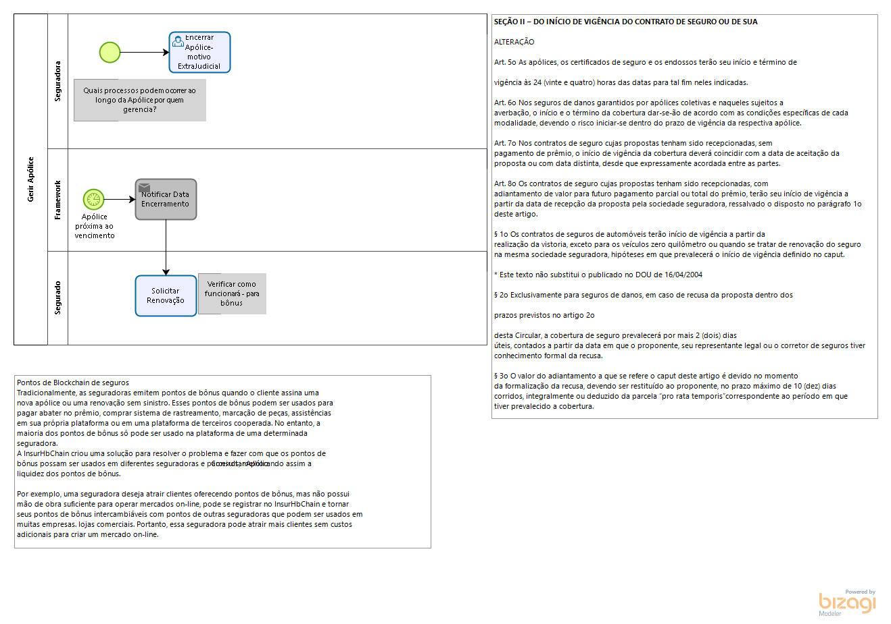
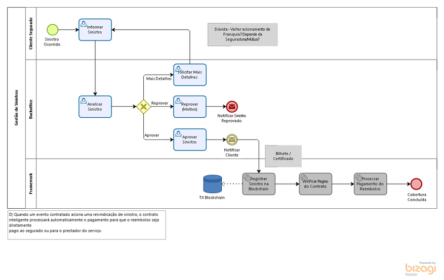
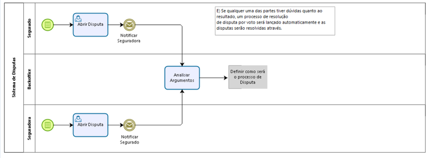
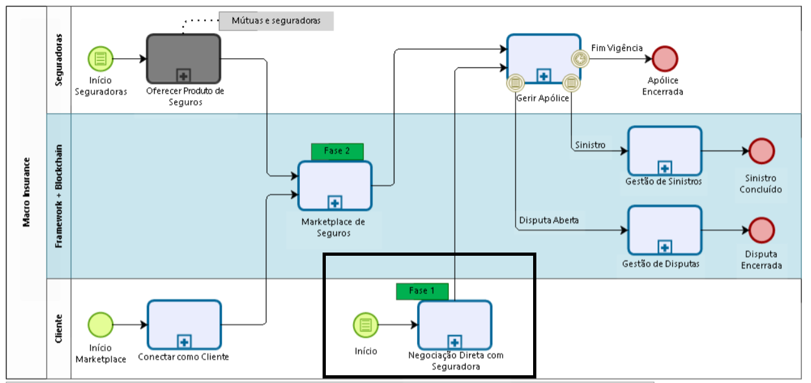
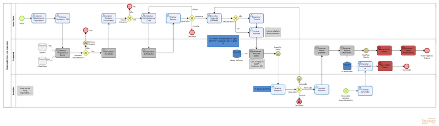
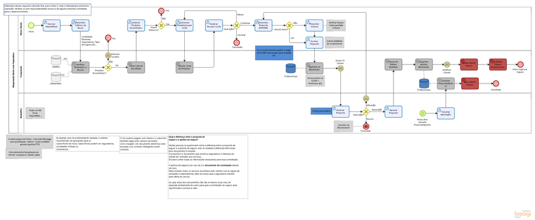

# Arquitetura

  

# Macro Insurance

## Insurance

  

### Oferecer Produto de Seguros

Esse processo na visão macro representa a infinita possibilidade de Seguradoras, Mútuas, Grupos e outros de disponibilizarem seus produtos e serviços através do framework que será desenvolvido. Futuramente, essa interação poderá ser feita através do Marketplace - por enquanto será empresa por empresa.
Seguradoras podem conectar seu serviço/produto à plataforma/blockchain - definir como seria essa entrada.

  

### Conectar como Cliente

  

Esse processo representa o acesso ao Framework como Cliente - futuramente para o Marketplace. No momento inicial  não haverá esse processo - acesso será direto do cliente com a Seguradora que deseja contratar e todas informações serão fornecidas ali.
Cliente faria seu acesso inicial à plataforma/blockchain e preencheria as informações necessárias para acessar o marketplace de Seguros. - definir requisitos.

### Marketpace de Seguros

**Confluence** | [Marketpace de Seguros](https://4cadia.atlassian.net/wiki/spaces/BI/pages/370901014/Marketplace+de+Seguros)

### Negociação Direta com Seguradora

**Confluence** | [Negociação Direta com Seguradora](https://4cadia.atlassian.net/wiki/spaces/BI/pages/366510086/Negocia%2Bo%2BDireta%2Bcom%2BSeguradora)

### Gerir Apólice

Esse processo representa a gestão que será feita sobre as Apólices geradas. Definir direito todos os processos que podem ocorrer aqui.

  

### Gestão de Sinistros

  

### Sistema de Disputas

Se qualquer uma das partes tiver dúvidas quanto ao resultado, um processo de resolução
de disputa por voto será lançado automaticamente e as disputas serão resolvidas através.
Esse processo deverá ser tratado no Marketplace???

  

# Negociação Direta com Seguradora

Esse processo representa o estágio inicial de interação entre os Usuários (clientes) com o Framework desenvolvido - que por sua vez irá interagir com a blockchain. Nesse processo, os clientes deverão acessar diretamente as plataformas das Seguradoras, Mútuas, etc, para efetuar a cotação, a proposta e a contratação da apólice já fazendo uso de registros em blockchain. Esse processo poderá futuramente cair em desuso pelo surgimento do Marketplace de Seguradoras.

  

  

# Marketplace de Seguros

  

Fase 2 do projeto contemplará o desenvolvimento de um Marketplace de Seguradoras (possivelmente utilizando plataforma VTex. Essa plataforma permitirá que usuários (mesmo sem cadastro) efetuem buscas por suas necessidades de seguro (futuramente todos segmentos, mas no momento apenas Auto) e localizar todas Mútuas e Seguradoras que ofereçam esses produtos e serviços. Ficará a cargo dos usuários fechar ou não com 1 ou mais dos produtos localizados - todas etapas de Proposta e Contratação, conforme regulamentação da SUSEP, serão respeitadas nesse processo.

# Processo cliente/administrativo/corretores

  

