# Artigos de instruções

## Testar Smart Contracts

### Instruções

## 1 - Pré Requisitos

?> Para executar os testes é necessário ter instalado: Git; Node js; Truffle e Ganache CLI

### Git

**Verifique sua versão do Git**

Você pode verificar sua versão atual do Git executando o ```git --versioncomando``` em um terminal (Linux, macOS) ou prompt de comando (Windows).

```
λ git --version
git version 2.21.0.windows.1
```

Se você não vir uma versão suportada do Git (a partir da versão 1.8.4.3.x), precisará atualizar o Git ou executar uma nova instalação.

**Instale ou Atualize o Git**

No site oficial baixe o instalador apropriado (https://git-scm.com/downloads)

Instalação:

| **Windows** | **Mac** | **Linux** |
| ----------- | ------- | --------- |
|Execute o instalador baixado. Para garantir que o git.exe esteja disponível no path, escolha Run Git from the Windows Command Prompt, ou Run Git and included Unix tools from the Windows Command Prompt. | Clique no arquivo .dmg baixado e clique duas vezes no ícone .pkg para executar o instalador. | Use o package manager para instalar o Git.  |
| 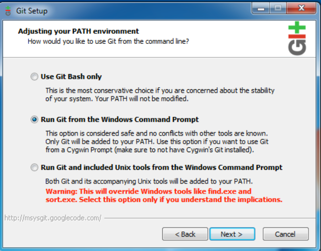 |  | ```sudo apt-get install git``` |

Para Mac e Linux: Se ainda não consegue ver a versão do Git, pode ser necessário adicionar o local de instalação do Git ao seu path. Abra seu arquivo   ```~/.profile``` em um editor de texto e adicione esta linha, onde  ```<path/to/git>``` é o local de instalação do Git: ```export PATH=$PATH:<path/to/git>```

!> Para mais informações de instalação do Git: 
> [Windows](https://git-scm.com/download/win)

> [Mac](https://git-scm.com/download/mac)

> [Linux](https://git-scm.com/download/linux)

### Node js 

**Verifique a versão do node js**

No terminal execute o comando ```node -v```

<p align="center">
  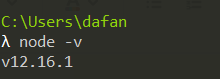
</p>

**Instale ou Atualize o Node js**

No site oficial baixe o instalador apropriado (https://nodejs.org/en/download/) e faça a instalação.

<p align="center">
  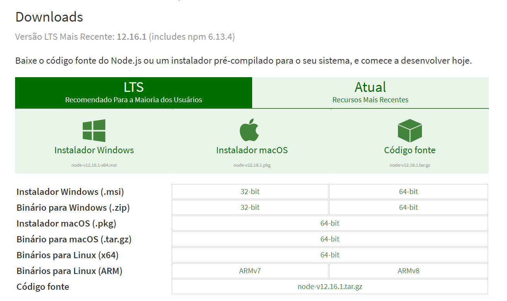
</p>

### Truffle

Instale o truffle (https://www.trufflesuite.com/truffle)

No terminal execute o comando ```npm install truffle -g```

### Ganache-CLI

Instale o ganache-cli (https://www.npmjs.com/package/ganache-cli)

No terminal execute o comando ```npm install -g ganache-cli```

## 2 - Clonar o Repositório

**Crie uma pasta para clonar os projetos**

No exemplo abaixo foi criada uma pasta com o nome “repo“ para clonar os  repositórios do bitbucket.

<p align="center">
  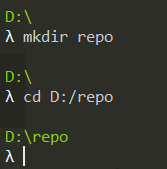
</p>

**Criar a chave SSH**

No terminal execute ```ssh-keygen```. Você verá uma resposta semelhante a esta:

<p align="center">
  
</p>

Basta pressionar < Enter > para aceitar o local padrão e o nome do arquivo. 

Digite uma senha quando for solicitado. Toda a interação será semelhante a esta:

<p align="center">
  
</p>

!> Para mais informações sobre criar chave SSH:

> https://confluence.atlassian.com/bitbucketserver/creating-ssh-keys-776639788.html

**Copiar a chave SSH**

No Windows, no prompt de comando, altere o diretório para o diretório .ssh e copie o arquivo de chave pública para a área de transferência executando. (diretório do arquivo ```/Users/<username>/.ssh```)

```
cd %userprofile%/.ssh
clip < id_rsa.pub
```

No macOS ou Linux, basta executar o seguinte em um terminal:

```
pbcopy < ~/.ssh/id_rsa.pub
```

**Associar ao Bitbucket a sua chave SSH**

|   |   |
| - | - |
| Acesse sua conta no Bitbucket e clique na imagem do seu perfil para acessar **settings**. | 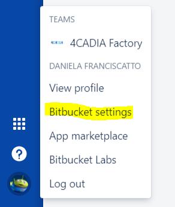 |
| Localize em security o item **SSH Keys** e clique. |  |
| Clique no botão **Add Key** e cole sua chave SSH. |  |

**Clonar o repositório**

No repositório do Bitbucket, clique no botão **clone**

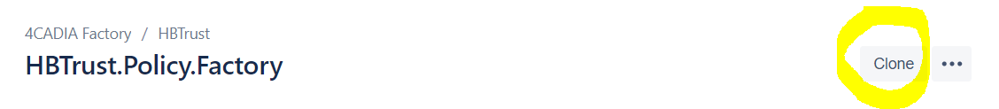

**Repositórios:**

> **Apólice** | [Connect to preview ](https://bitbucket.org/janusplatform/hbtrust.policy.factory/src/master/)

> **Sinistro** | [Connect to preview ](https://bitbucket.org/janusplatform/hbtrust.claim.factory/src/master/)

> **Laudo**    | [Connect to preview ](https://bitbucket.org/janusplatform/hbtrust.policyreport.factory/src/master/)

E copie o endereço exibido:

<p align="center">
  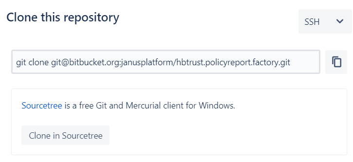
</p>

No terminal, dentro da pasta criada para clonar os repositórios, cole o endereço copiado e clique em enter:

<p align="center">
  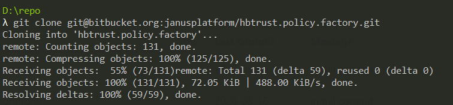
</p>

Navegue até o repositório clonado

<p align="center">
  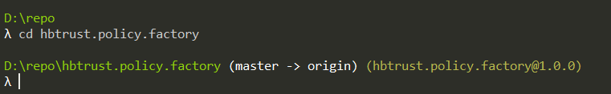
</p>

## 3 - Executar o Teste

**Iniciar o ganache-cli**

Abra um terminal e execute o comando:

```
ganache-cli --allowUnlimitedContractSize --gasLimit 9000000
```

Você terá um resultado como esse:

<p align="center">
  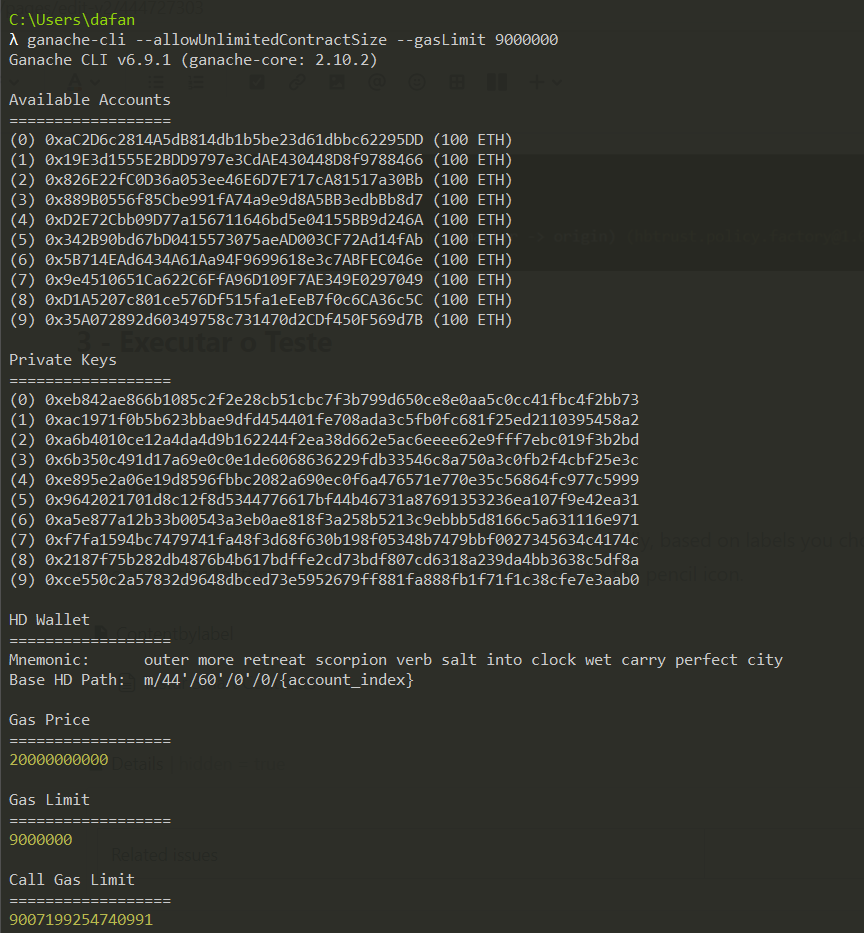
</p>

**Iniciar o npm no repositório**

No terminal onde está aberto o diretório do repositório, executar o comando:

```
npm i
```

<p align="center">
  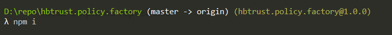
</p>

**Executar o teste**

Para executar todos os arquivos de teste:

```
truffle test
```

<p align="center">
  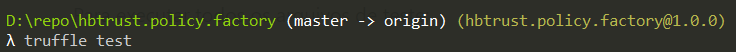
</p>

Para executar um arquivo específico de teste:

```
truffle test <file_path>
```

<p align="center">
  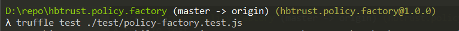
</p>

**Resultado dos testes**

Você verá um resultado como esse no terminal:

<p align="center">
  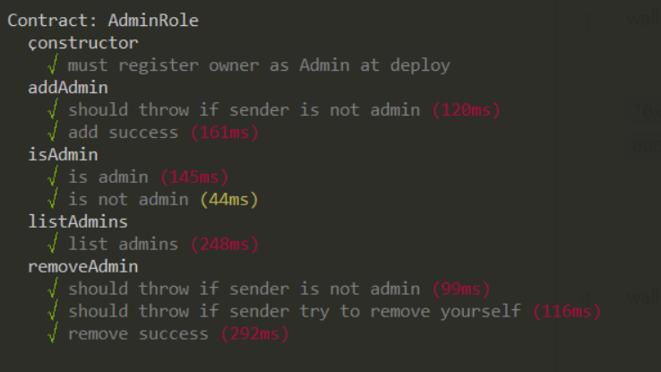
</p>

## Testes API

?> **Pré Requisitos**
>
> Para executar os testes é necessário ter instalado:
>
> Git: https://git-scm.com/downloads
>
> Nodejs: https://nodejs.org/en/download/
>
> NPM: https://www.npmjs.com/get-npm

### Clonar o Repositório Bitbucket

- **Crie uma pasta para clonar os projetos**

No exemplo abaixo foi criada uma pasta com o nome “repo“ para clonar os repositórios do bitbucket.

<p align="center">
  
</p>

- **Criar a chave SSH**

No terminal execute ```ssh-keygen```. Você verá uma resposta semelhante a esta:

<p align="center">
  
</p>

Basta pressionar < Enter > para aceitar o local padrão e o nome do arquivo. 

Digite uma senha quando for solicitado. Toda a interação será semelhante a esta:

<p align="center">
  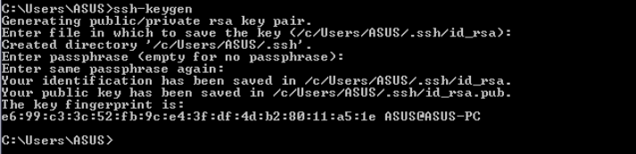
</p>

!> Para mais informações sobre criar chave SSH:
>
> https://confluence.atlassian.com/bitbucketserver/creating-ssh-keys-776639788.html

- **Copiar a chave SSH**

No Windows, no prompt de comando, altere o diretório para o diretório .ssh e copie o arquivo de chave pública para a área de transferência executando. (diretório do arquivo ```/Users/<username>/.ssh```)

```
cd %userprofile%/.ssh
clip < id_rsa.pub
```

No macOS ou Linux, basta executar o seguinte em um terminal:

```
pbcopy < ~/.ssh/id_rsa.pub
```

- **Associar ao Bitbucket a sua chave SSH**

|   |   |
| - | - |
| Acesse sua conta no Bitbucket e clique na imagem do seu perfil para acessar **settings**. |  | 
| Localize em security o item **SSH Keys** e clique. | 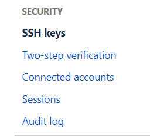 |
| Localize em security o item **SSH Keys** e clique. | 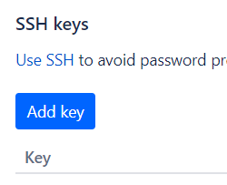 |

- **Clonar o repositório**

No repositório do Bitbucket, clique no botão **clone**.

**Repositório:**

**API Apólice** | [Connect to preview](https://bitbucket.org/janusplatform/hbtrust.domain.policy/src/master/)

<p align="center">
  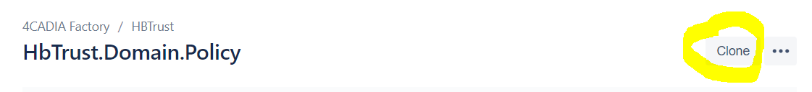
</p>

E copie o endereço exibido:

```
git clone git@bitbucket.org:janusplatform/hbtrust.domain.policy.git
```

<p align="center">
  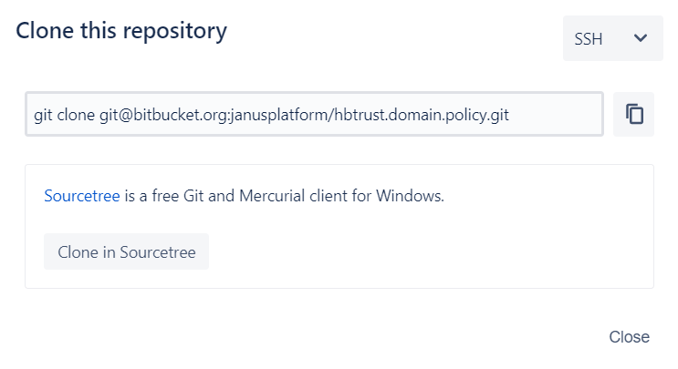
</p>

No terminal, no diretório criado para clonar os repositórios, cole o endereço copiado e clique em enter:

<p align="center">
  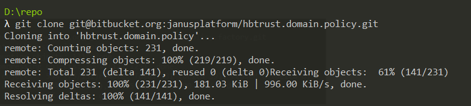
</p>

Navegue até o repositório clonado

<p align="center">
  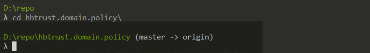
</p>

### Executar a API

No diretório do repositório clonado executar o comando:

```
npm install
```

### Criar e configurar arquivo .env

Para poder executar a API é necessário criar na raiz do diretório o arquivo .env

Clone o arquivo .env.example com as seguintes especificações:

```
MNENOMIC = // Your metamask's recovery words
INFURA_API_KEY = // Your Infura API Key after its registration
NETWORK_ID = // 1-Mainnet 3-Ropsten 4-Rinkeby 42-Kovan 1001-Development
TOKEN = // PDBToken Address
```

### Executar o nodemoon no localhost

No terminal acesse a pasta raiz do repositório que foi clonado execute o comando para executar a API:

```
npm start
```

Após executar este comando o nodemoon será inicializado e a API já estará funcionando no endereço http://localhost:3000/.

## Insurance processes

### Geração de Carteira

|   |   |
| - | - |
| API | hbtrust.domain.token |
| Método | POST/generateETHwalles |

Critério de aceite:

Toda seguradora precisa ter uma Ethereum Wallet. 

API do token fornece o serviço de geraração de wallet retornando o address, Private Key e a seed phrase.

<p align="center">
  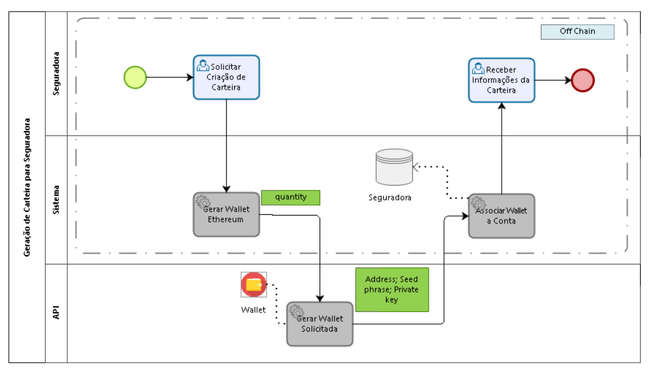
</p>

> **Requisição**

Quantidade de wallets a ser criada.

<p align="center">
  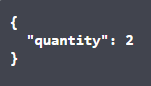
</p>

> **Resposta**

- index - ordenação da wallet gerada

- mnemonic - grupo de palavras que dão acesso a wallet. Precisa ser tratada como sua private key pois com o mnemonic qualquer um pode acessar sua carteira

- address - o endereço da sua carteira

- private Key - sua assinatura para transações feitas no Ethereum

<p align="center">
  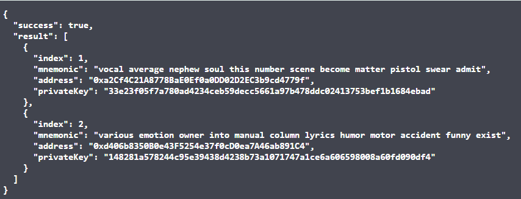
</p>

### Geração de Apólice

> **Criar Apólice**

|   |   |
| - | - |
| API | hbtrust.domain.policy |
| Método | POST/policy-factory |

> **Mint Token HBT**

|   |   |
| - | - |
| API | hbtrust.domain.token |
| Método | POST/mintTo |

Critério de aceite:

Após a assinatura da Apólice a mesma é registada em Blockchain criando o smart contract da apólice e registrando as informações.

O serviço que irá criar os tokens HBT na wallet de cada mútua recebe os respectivos address e retorna o hash da transação efetuada.

<p align="center">
  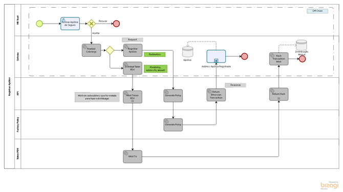
</p>

#### Criar Apólice

> **Requisição**

Para criar uma apólice é necessário enviar todas as informações relacionadas.

- private Key - quem realiza essa transação precisa estar na role “insurance Company“. Essa private key precisa ser de uma seguradora

- insurance Company - os address das seguradoras que participam dessa apólice.

Campos Apólice:

| categoria | Variavel | Descrição | Type | Exemplo |
| --------- | -------- | --------- | ---- | ------- |
| privateKey | | Chave privada de quem assina a transação (msg.sender) | ```string``` | 2BFB60E72FB1C275CEC44446194A1620F22555668647149148593614787C3F00 |
| | | | | |
| insuranceCompany | ```wallets``` | Numeros da carteiras de cada seguradora pertencente a apólice. | ```address[]``` | [0x7105d236BdA4Db17666807726D99B70b1da19tau, 0x7105d236BdA4Db17666807726D99B70b1da19qwe, 0x7105d236BdA4Db17666807726D99B70b1da19def] |
| | | | | |
| Coverage | ```prizeAmount``` | Valor pago da cobertura | ```unit256``` | 3400 |
| | ```fipePercentage``` | Indice da tabela fipe | ```uint256``` | 2% |
| | ```app``` | Acidentes Pessoais de Passageiros | ```string``` | App1 |
| | ```glasses``` | Cobertura de vidro | ```uint256``` | 1 |
| | ```rcfMaterials``` | Responsabilidade Civil Facultativa danos Materiais | ```string``` | rcfM1 |
| | ```rcfMaterials``` | Responsabilidade Civil Facultativa danos Materiais | ```string``` | rcfM1 |
| | ```rcfBodily``` | Responsabilidade Civil Facultativa danos corporais | ```string``` | rcfB1 |
| | ```reserveCar``` | Se a cobertura paga possui carro reserva | ```uint256``` | 2 |
| | ```franchise``` | Participação obrigatória do segurado em um sinistro | ```uint256``` | 1 |
| | ```productCoverage``` | Produto segurado | ```string[]``` |  [982001, 90201, 33221] |
| | | | | |
| policyInformation | ```proposal``` | Identificação da Proposta que gerou a apólice | ```string``` | proposal1 | 
| | ```apolice``` | Identificação da apólice (interno) | ```string``` | policy1 |
| | ```startValidity```| Data de início da vigência | ```unit256```| 1249052401 |
| | ```endValidity```| Data de fim da vigência | ```unit256``` | 1249052401 |
| | ```apoliceStatus```| Status da apólice | ```unit256``` | 2 |
| | | | | |
| PolicyHolderData | ```nameComplete```| Nome do segurado | ```string``` | client | 
| | ```dateOfBirth``` | Data nascimento segurado | ```unit256``` | 1249052401 |
| | ```maritalSatuts```| Estado civil | ```unit256``` | 1 |
| | ```poket```| | ```string```| pocket1 |
| | ```cnpjCpf```| CPF/CNPJ | ```string``` | cpf11111111111 |
| | ```gender```| Gênero | ```unit256``` | 2 |
| | ```relationshipPolicyHolder```| Grau de parentesco | ```unit256```| 1 |
| | | | | |
| VehicleDataModel | ```typeParam``` | Tipo do veículo | ```unit256```| 1 |
| | ```maker```| Marca | ```unit256``` | 234 |
| | ```model```| Modelo |```unit256```| 23451 |
| | ```numberSlices```| |```unit256```| 5 |
| | ```yearManufactur```|Ano de fabricação|```unit256```| 2019 |
| | ```yearModel``` | Modelo ano |```unit256```| 2020 |
| | ``licensePlate`` | Placa | ```string```| ENV4211 |
| | ```chassis``` | Chassis | ```string``` | 3819920039813B23 |
| | ```renavan```| Renavan | ```string``` | 32441HGS |
| | ```fuel``` | Tipo de combustível | ```unit256``` | 1 |
| | ```newVehicle``` | Se é veículo zeroKM | ```unit256``` | 1 |
| | ```vehicleFinaced``` | Se é financiado | ```unit256``` | 1 |
| | ```color``` | Cor | ```unit256``` | 1 |
| | | | | |
| DriverDataModel | ```nameComplete``` | Nome do motorista | ```string``` | 4CADIA Factory |
| | ```dateOfBirth``` | Data de nascimento | ```unit256``` | 1984-01-12 |
| | ```maritalStatus``` | Estado civil | ```unit256``` | 1 |
| | ```poket```| | ```string```| 6140020 |
| | ```cnpjCpf```| CPF/CNPJ | ```string``` | 99999999999 |
| | ```gender```| Gênero | ```unit256``` | 2 |
| | ```profession``` | Profissão | ```unit256``` | 2341 |
| | ```cnh``` | Carteira de Habilitação | ```string``` | 3221333211 |
| | ```dateFirstCnh``` | Data da primeira carteira de habilitação | ```unit256``` | 2013-02-01 |
| | ```garage``` | Se o veículo fica em garagem | ```unit256``` | 1 |
| | ```usesWork``` | Se é usado para trabalho | ```unit256``` | 1 |
| | ```vehicleUse``` | Tipo de utilização do veículo | ```unit256``` | 2 |

> **Resposta**

- link - link do Etherscan para a transação efetuada

<p align="center">
  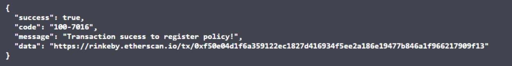
</p>

#### Mint Tokens HBT

> **Requisição**

- private key - apenar quem estiver na role “minter“ pode utilizar a função de mint. Essa função cria tokens HBT na carteira do destinatário, o parâmetro “to“. Ao criar tokens o minter aumenta o Total Supply.

- sender - é o address da carteira de quem está assinando a transação de criar tokens, no caso o address do minter

- to - é o address da seguradora que vai receber os tokens criados

- amount - a quantidade de tokens a serem criados na carteira da seguradora

<p align="center">
  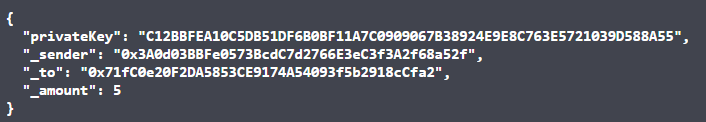
</p>

> **Resposta**

- hash - identificação da transação realizada

- link - link do Etherscan para a transação efetuada

### Alteração do Status (Apólice, Laudo e Sinistro)

> **Policy**

|   |   |
| - | - |
| API | hbtrust.domain.policy |
| Método | POST/policy-factory |

> **Insurance Claim e Policy Report**

|   |   |
| - | - |
| API | hbtrust.domain.claim |
| Método Insurance Claim | PUT/insurance-claim |
| Metodo Policy Report | PUT/policy-report |

Critério de aceite:

Possibilidade de alteração do status da apólice, sinistro e laudo para que a condição atual dos documentos registrados on-chain possam estar atualizados com o processo executado off-chaim.

<p align="center">
  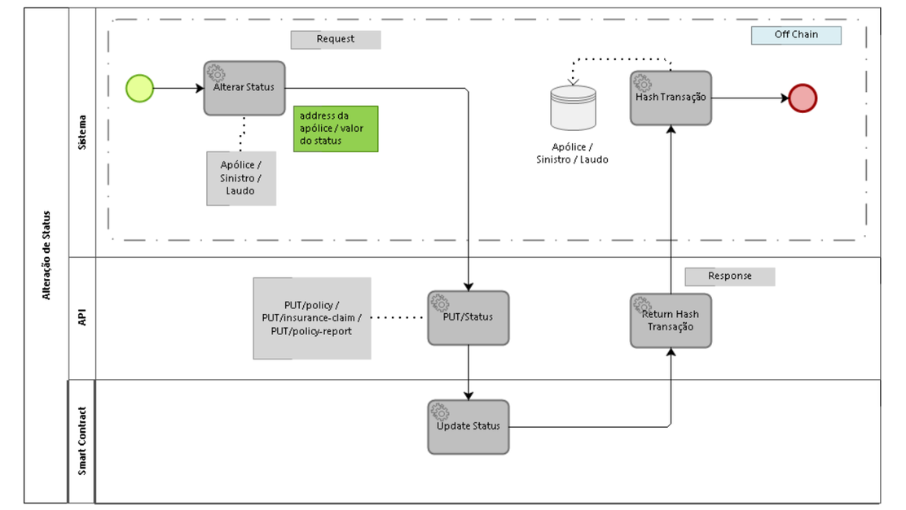
</p>

> **Requisição**

- private key - quem realiza essa transação precisa estar na role “insurance Company“. Essa private key precisa ser de uma seguradora

- contract address - o address do smart contract que terá a alteração de status

- status - o valor do novo status

<p align="center">
  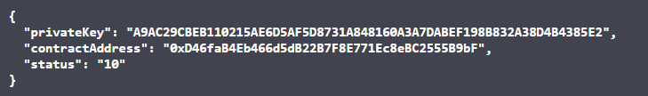
</p>

> **Resposta**

- link - link do Etherscan para a transação efetuada

<p align="center">
  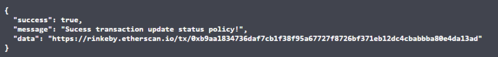
</p>

### Abertura do Sinistro

|   |   |
| - | - |
| API | hbtrust.domain.claim |
| Método | POST/insurance-claim |

Critério de aceite:

Com a aprovação do sinistro e a verificação da vigência da apólice, os parâmetros do sinistro são enviados para ser criado o smart contract e assim registrado em blockchaim.

<p align="center">
  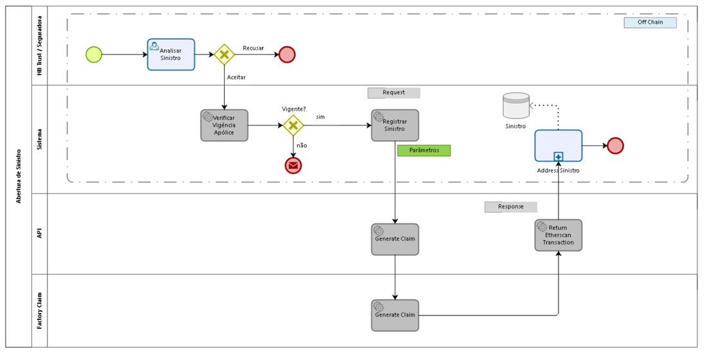
</p>

> **Requisição**

Para criar um sinistro é necessário enviar todas as informações relacionadas.

- private Key - quem realiza essa transação precisa estar na role “insurance Company“. Essa private key precisa ser de uma seguradora

- insurance Company - os address das seguradoras que participam dessa sinistro.

| categoria | Variavel | Descrição | Type | Exemplo |
| --------- | -------- | --------- | ---- | ------- |
| privateKey | | Chave privada de quem assina a transação (msg.sender) | ```string``` | 2BFB60E72FB1C275CEC44446194A1620F22555668647149148593614787C3F00 |
| | | | | |
| mutual | ```wallets``` | Numeros da carteiras de cada seguradora pertencente ao sinistro. | ```string``` | [0x09c15427Fed859ed46AFFB996bCd62f3b9180137] |
| | | | | |
| apoliceData | ```apolice``` | Identificação da apólice (interno) | ```unit256``` | 123456 |
| | ```start_validity``` | Data de início da vigência | ```unit256``` | 01/01/2020 |
| | ```end_validity``` | Data de fim da vigência | ```unit256``` | 02/01/2020 |
| | ```apolice_status``` | Status da apólice | ```unit256``` | 1 |
| | | | | |
| claimInformation | ```claim``` | Identificação do sinistro (interno) | ```string``` | 123456 |
| | ```claimStatus ``` | Status do sinistro | ```unit256``` | 1 |
| | | | | |
| conductorData | ```name_complete``` | Nome do motorista | ```string``` | client |
| | ```dateOfBirth``` | Data de nascimento | ```string``` | 01/01/2020 |
| | ```maritalStatus``` | Estado civil | ```unit256``` | 1 |
| | ```poket```| | ```string```| 6140020 |
| | ```cnpjCpf```| CPF/CNPJ | ```string``` | 99999999999 |
| | ```gender```| Gênero | ```unit256``` | 1 |
| | ```profession``` | Profissão | ```unit256``` | dev |
| | ```cnh``` | Carteira de Habilitação | ```string``` | 3221333211 |
| | ```category_cnh``` | Categoria da carteira de habilitação | ```string``` | b |
| | ```date_validate_cnh``` | Data da validade da carteira de habilitação | ```unit256``` | 01/03/2020 |
| | | | | |
| ocurrenceData | ```claim_number``` | Numero do sinistro (interno) | ```unit256``` | 123456 |
| | ```date_occurrence``` | Data da ocorrência do sinistro | ```string``` | 01/10/2020 |
| | ```time_occurrence``` | Horário da ocorrência do sinistro. | ```string``` | 13 |
| | ```place_occurrence``` | Local da ocorrência do sinistro | ```string``` | place |
| | ```police_report``` | Laudo da polícia | ```unit256``` | 678767 |
| | ```protocol_police_report``` | Protocolo do laudo policial | ```unit256``` | 1 |
| | ```conductor_guilty_occurrence``` | Condutor no momento da ocorrência | ```unit256``` | 1 |
| | ```ocurrence_description``` | Descrição da ocorrência | ```string``` | adc |
| | ```victims``` | Quantidade de vítimas | ```unit256``` | 1 |
| | ```damage_victims``` | Descrição dos danos causados nas vítimas | ```unit256``` | 1 |
| | | | | |
| thirdPartyData | ```involvement_3rd``` |  | ```unit256``` | 2 |
| | ```how_many_involvement``` |  | ```unit256``` | 3 |
| | ```licenses_plates``` |  | ```string[]``` | [aaa1234] |
| | ```damage_caused``` |  | ```string``` | none |
| | | | | |
| vehicleData | ```vehicle_type``` | Tipo do veículo | ```unit256``` | 1 |
| | ```maker``` | Marca | ```unit256``` | 4 |
| | ```model``` | Modelo | ```unit256``` | 19 |
| | ```numer_slides``` |  | ```unit256``` | 5 |
| | ```year_manufacture``` | Ano de fabricação | ```unit256``` | 2010 |
| | ```year_model``` | Modelo ano | ```unit256``` | 2011 |
| | ```license_plate``` | Placa | ```string``` | 1 |
| | ```chassis``` | Chassis | ```string``` | 11111A1111 |
| | ```renavam``` | Renavan | ```string``` | 11111N1111 |
| | ```fuel``` | Tipo decombustível | ```unit256``` | 1 |

> **Resposta**

- link - link do Etherscan para a transação efetuada

<p align="center">
  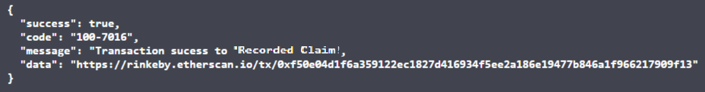
</p>

### Abertura do Laudo

|   |   |
| - | - |
| API | hbtrust.domain.claim |
| Método | POST/policy-report |

Critério de aceite:

Criação de laudos solictados por seguradoras e relacionados ao sinistro.

<p align="center">
  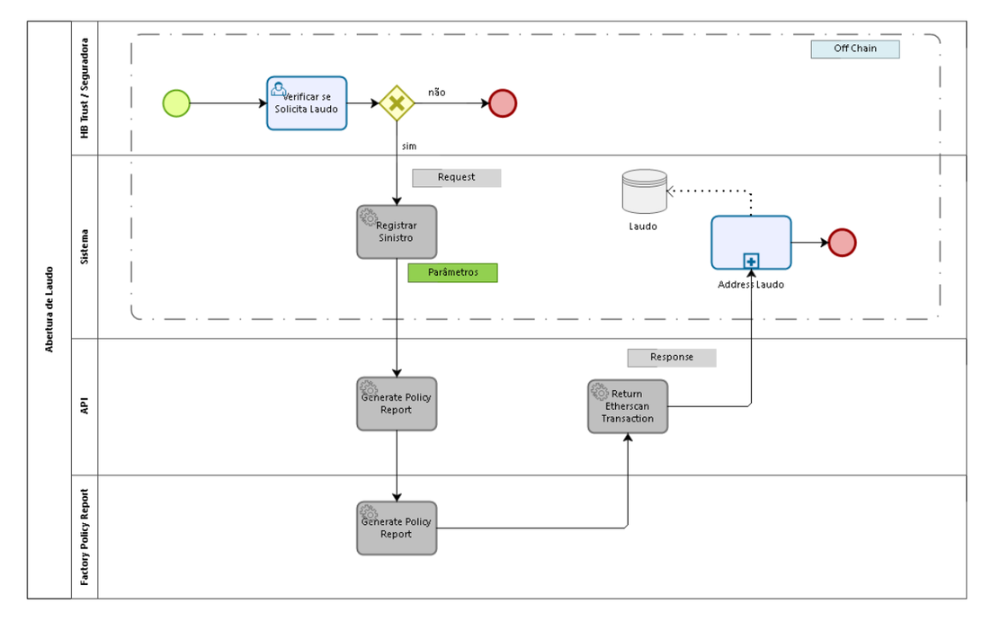
</p>

> **Requisição**

Para criar um laudo é necessário enviar todas as informações relacionadas.

- private Key - quem realiza essa transação precisa estar na role “insurance Company“. Essa private key precisa ser de uma seguradora

- insurance Company - os address das seguradoras que participam desse laudo.

| categoria | Variavel | Descrição | Type | Exemplo |
| --------- | -------- | --------- | ---- | ------- |
| privateKey | | Chave privada de quem assina a transação (msg.sender) | ```string``` | 2BFB60E72FB1C275CEC44446194A1620F22555668647149148593614787C3F00 |
| | | | | |
| mutual | ```wallets``` | Numeros da carteiras de cada seguradora pertencente ao sinistro. | ```string``` | [0x09c15427Fed859ed46AFFB996bCd62f3b9180137] |
| | | | | |
| ocurrenceData | ```claim_number``` | Numero do sinistro (interno) | ```unit256``` | 123456 |
| | ```date_occurrence``` | Data da ocorrência do sinistro | ```string``` | 01/10/2020 |
| | ```time_occurrence``` | Horário da ocorrência do sinistro. | ```string``` | 13 |
| | ```place_occurrence``` | Local da ocorrência do sinistro | ```string``` | place |
| | ```police_report``` | Laudo da polícia | ```unit256``` | 678767 |
| | ```protocol_police_report``` | Protocolo do laudo policial | ```unit256``` | 1 |
| | ```conductor_guilty_occurrence``` | Condutor no momento da ocorrência | ```unit256``` | 1 |
| | ```ocurrence_description``` | Descrição da ocorrência | ```string``` | adc |
| | ```victims``` | Quantidade de vítimas | ```unit256``` | 1 |
| | ```damage_victims``` | Descrição dos danos causados nas vítimas | ```unit256``` | 1 |
| | | | | |
| assistanceData | ```cnpjCpf``` | CPF/CNPJ | ```string``` | 99999999999 |
| | ```nameComplete``` | Nome Completo da assistência técnica | ```string``` | Assistencia tecnica |
| | | | | |
| technicalReport | ```reportNumber``` | Identificação do laudo (interna) | ```string``` | 252415 |
| | ```reportStatus``` | Status do laudo | ```unit256``` | 2 |
| | ```damageComponents``` | Componentes danificados | ```string[]``` | [2, 1, 32] |
| | ```manpower``` | Descrição da mão de obra | ```string``` | Descrição da mão de obra |
| | ```technicalAdvice``` | Relato do parecer técnico | ```string``` | Relato do parecer técnico |

> **Resposta**

- link - link do Etherscan para a transação efetuada

<p align="center">
  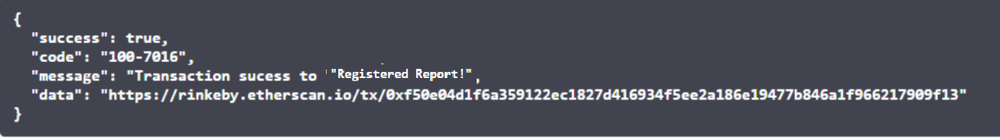
</p>

## Manual HBTrust.domain.policy

### Visão Geral

A API HBTrust.domain.policy fornece os serviços necessários para administrar e executar as funções do smart contract Policy Factory e Policy.

O smart contract Policy  Factory possui as funções de criar smart contract de apólices (Policy). Para cada apólice é criado um smart contract, registrando suas  informações na blockchain. Cada smart contract Policy pode executar funções de consulta e alteração do status.

<p align="center">
  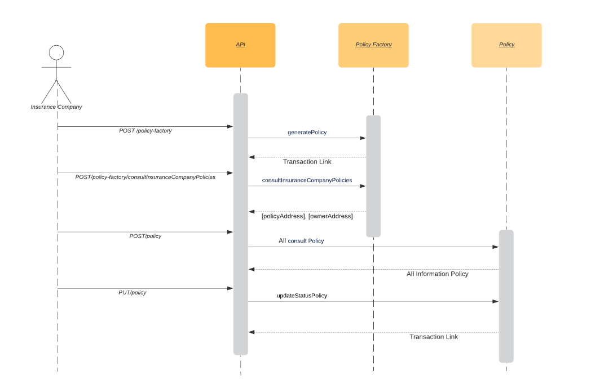
</p>

### Administração do Smart Contract

Para administrar o smart contract de apólices é necessário ter uma carteira ethereum. Com o address dessa carteira o owner do contrato pode adicionar essa carteira como administrador do smart contract. 

|   |   |
| - | - |
| owner | O address da carteira que publica o smart contract na rede. Esse address é inserido em todas as roles do smart contract no momento da publicação. |
| carteira | As carteiras permitem que os usuários do Ethereum armazenem o Ether e interajam com contratos inteligentes na rede Ethereum. |
| address | O address Ethereum são identificadores exclusivos derivados de chaves públicas. Private Key -> Public Key -> Ethereum Address |
| smart contracts | Um smart contract é o código da aplicação publicado na rede blockchain do Ethereum. Executa as regras de negócios definidas para a apólice. |

#### Funções administrativas

As roles em um smart contract definem os papéis realizados por cada entidade. O smart contract da apólice possue as roles: Insurance Company e Admin.

**Admin role**

- Responsável por contolar as funções de **adicionar** e **remover** outros admins.

| Método API | Função Smart Contract |
| - | - |
| POST/role/admin | ```addAdmin``` |
| DELETE/role/admin | ```removeAdmin``` |

- Responsável por controlar as funções de **adicionar** e **remover** seguradoras.

| Método API | Função Smart Contract |
| - | - |
| POST/role/insurance-company | ```addInsuranceCompany``` |
| DELETE/role/insurance-company | ```removeInsuranceCompany``` |

- Responsável por **pausar / ativar** o smart contract quando necessário

| Método API | Função Smart Contract |
| - | - |
| POST/lifecycle/pause | ```pause``` |
| POST/lifecycle/unpause | ```unpause``` |

**Insurance Company role**

Essa role dá a permissão para criar apólices, alterar o status de uma apólice e realizar as consultas da apólice.

| Método API | Função Smart Contract |
| - | - |
| POST /policy-factory | ```generatePolicy``` |
| POST/policy-factory/consultInsuranceCompanyPolicies | ```consultInsuranceCompanyPolicies``` |
| POST/policy |```consultPolicyCoverage; consultDriver; consultPolicyHolder; consultPolicyInformation; consultPolicyInsuranceCompany; consultVehicle; consultVehicleDocuments``` |
| PUT/policy | ```updateStatusPolicy``` |

#### Criar apólice

Após a publicação do smart contract na rede Ethereum, o owner do contrato que foi adicionado automáticamente na role admin, elege quem será administrador desse smart contract e adiciona o address na role admin.

<p align="center">
  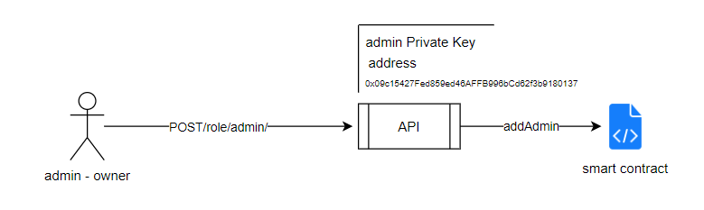
</p>

Essa função de admin pode controlar quem é adicionado ou removido tanto da função admin quanto da função de insurance company. Então o admin adiciona as seguradoras na role insurance company. Toda seguradora precisa ter uma carteira Ethereum para que o address dessa carteira seja adicionado na role insurance company pelo admin.

<p align="center">
  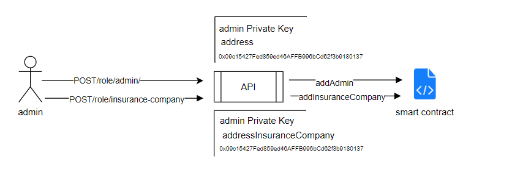
</p>

As seguradoras, já com a permissão, ao enviarem os parâmetros para a criação da apólice, a mesma é criada e registrada na blockchain.

<p align="center">
  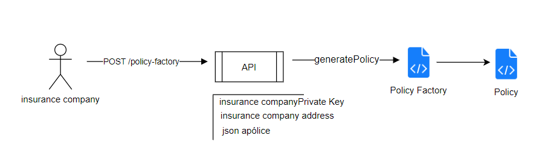
</p>

### Executar um método por meio do swagger

|   |   |
| - | - |
| swagger | http://hbtrust-policy.4cadia.com/swagger/#/ |
| Rinkeby | https://rinkeby.etherscan.io/address/0x059369f9866f9a4dd74a86c068f676e4d76856bb |

Na página do swagger você pode selecionar um método GET/POST/PUT e clicar no botão **try it out.**

Os métodos GET podem ser executados com a introdução dos parâmetros nos campos requisitados.

Já os métodos POST/PUT podem ser executados com a edição do body com os parâmetros necessários.

Após a edição clique em **Execute** e o método será executado.

| MÉTODO | DESCRIÇÃO |
| - | - |
| **POST** | O método HTTP ```POST``` é utilizado na criação dos recursos ou no envio de informações que serão processadas. Por exemplo, criação de um sinistro ou laudo, consultas das informações de sinistro e laudo. |
| **PUT** | O método HTTP ```PUT``` é utilizado para atualização de um recurso já existente. Por exemplo, alteração do status. |
| **GET** | O método HTTP ```GET``` é utilizado para consultas de recursos já existentes. Por exemplo, consulta de roles.

### Métodos

> **Policy Factory**

Os métodos do Policy Factory precisam ser assinados por address que possuem dentro do smart contract  a permissão de seguradoras. Essa assinatura é chamada de private Key. O admin do smart contract primeiramente precisa adicionar o address da seguradora na role Insuranse Company, a partir daí a seguradorá terá a permissão de criar apólices e consultar apólices utilizando sua private Key.

**POST /policy-factory**

Por meio deste método é possível  criar e registrar uma apólice na blockchain. É necessário estar na role Insurance Company.

##### Parameters

- private Key - quem realiza essa transação precisa estar na role “insurance Company“. Essa private key precisa ser de uma seguradora

- insurance Company - os address das seguradoras que participam dessa apólice.

- Campos:

```
{
	"privateKey":"7FDE0137C2E831A713A7415FB1256E7605EBFF04020345EB4E043B0C95BF27BD",
	"insuranceCompany": {
    	"wallets": ["0x71fC0e20F2DA5853CE9174A54093f5b2918cCfa2", "0x17cA6A08758F4A078B9c53ca25E6F6736dF34094"]
	},
	"coverage": {
	    "prizeAmount": "1000",
	    "fipePercentage": "5",
	    "app": "1",
	    "glasses": 1,
	    "rcfMaterials": "1",
	    "rcfBodily": "1",
	    "reserveCar": 1,
	    "franchise": 1,
	    "productCoverage": [
	      "1", "2"
	    ]
	},
	"policyInformation": {
	    "proposal": "1",
	    "apolice": "13334",
	    "startValidity": 1586305780,
	    "endValidity": 1617841780,
	    "apoliceStatus": 1
	},
	"policyHoldedrData": {
	    "nameComplete": "client",
	    "dateOfBirth": 492308980,
	    "maritalStatus": 1,
	    "pocket": "1",
	    "cnpjCpf": "11111111111",
	    "gender": 1,
	    "relationshipPolicyHolder": 1
	},
	"vehicleData": {
	    "typeParam": 1,
	    "marker": 1,
	    "model": 1,
	    "numerSlides": 5,
	    "yearManufacture": 2000,
	    "yearModel": 2001,
	    "licensePlate": "11111",
	    "chassis": "1111111111",
	    "renavam": "1111111111",
	    "fuel": 1,
	    "newVehicle": 1,
	    "vehicleFinaced": 1,
	    "color": 3
	},
	"driverData": {
	    "nameComplete": "client",
	    "dateOfBirth":492308980 ,
	    "maritalStatus": 1,
	    "pocket": "1",
	    "cpfCnpj": "111111111111",
	    "gender": 1,
	    "profession": 1,
	    "cnh": "111111",
	    "dateFirstCnh":955153780 ,
	    "garage": 1,
	    "usesWork": 1,
	    "vehicleUse": 1
		}
}
```
<p align="center">
  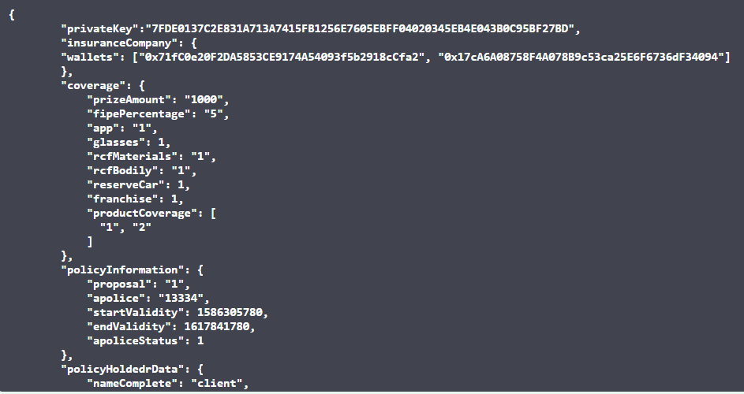
</p>

##### Response

- link - link do Etherscan para a transação efetuada

<p align="center">
  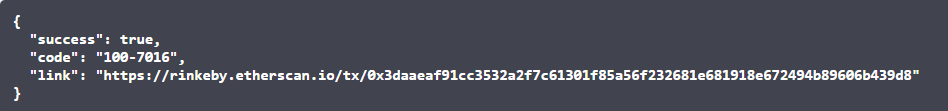
</p>

<p align="center">
  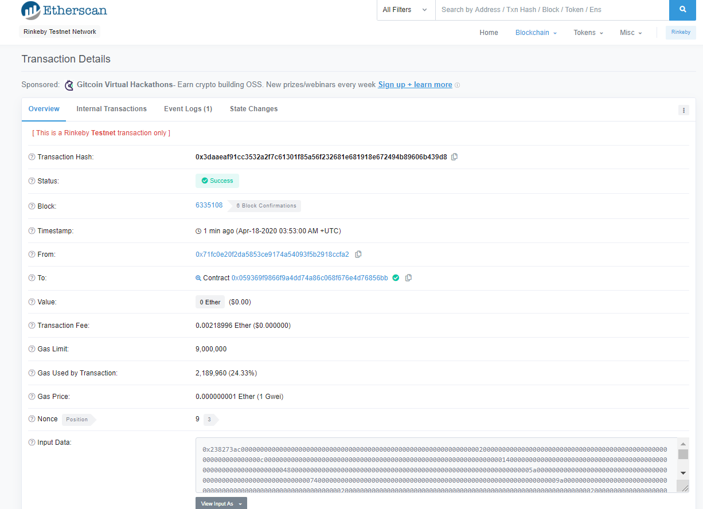
</p>

**POST /policy-factory**

Por meio deste método é possível  criar e registrar uma apólice na blockchain. É necessário estar na role Insurance Company.

##### Parameters

- private Key - quem realiza essa transação precisa estar na role “insurance Company“. Essa private key precisa ser de uma seguradora

- insurance Company - os address das seguradoras que participam dessa apólice.

- Campos:

```
{
	"privateKey":"7FDE0137C2E831A713A7415FB1256E7605EBFF04020345EB4E043B0C95BF27BD",
	"insuranceCompany": {
    	"wallets": ["0x71fC0e20F2DA5853CE9174A54093f5b2918cCfa2", "0x17cA6A08758F4A078B9c53ca25E6F6736dF34094"]
	},
	"coverage": {
	    "prizeAmount": "1000",
	    "fipePercentage": "5",
	    "app": "1",
	    "glasses": 1,
	    "rcfMaterials": "1",
	    "rcfBodily": "1",
	    "reserveCar": 1,
	    "franchise": 1,
	    "productCoverage": [
	      "1", "2"
	    ]
	},
	"policyInformation": {
	    "proposal": "1",
	    "apolice": "13334",
	    "startValidity": 1586305780,
	    "endValidity": 1617841780,
	    "apoliceStatus": 1
	},
	"policyHoldedrData": {
	    "nameComplete": "client",
	    "dateOfBirth": 492308980,
	    "maritalStatus": 1,
	    "pocket": "1",
	    "cnpjCpf": "11111111111",
	    "gender": 1,
	    "relationshipPolicyHolder": 1
	},
	"vehicleData": {
	    "typeParam": 1,
	    "marker": 1,
	    "model": 1,
	    "numerSlides": 5,
	    "yearManufacture": 2000,
	    "yearModel": 2001,
	    "licensePlate": "11111",
	    "chassis": "1111111111",
	    "renavam": "1111111111",
	    "fuel": 1,
	    "newVehicle": 1,
	    "vehicleFinaced": 1,
	    "color": 3
	},
	"driverData": {
	    "nameComplete": "client",
	    "dateOfBirth":492308980 ,
	    "maritalStatus": 1,
	    "pocket": "1",
	    "cpfCnpj": "111111111111",
	    "gender": 1,
	    "profession": 1,
	    "cnh": "111111",
	    "dateFirstCnh":955153780 ,
	    "garage": 1,
	    "usesWork": 1,
	    "vehicleUse": 1
		}
}
```

<p align="center">
  
</p>

##### Response

- link - link do Etherscan para a transação efetuada

<p align="center">
  
</p>

<p align="center">
  
</p>

### POST/policy-factory/consultInsuranceCompanyPolicies

Por meio deste método é possível listar todas as apólices e owners da companhia de seguros registradas na Blockchain. É necessário estar na role Insurance Company.

##### Parameters

- private Key - quem realiza essa transação precisa estar na role “insurance Company“. Essa private key precisa ser de uma seguradora

- address insurance Company - o address da seguradora que participam dessa apólice

<p align="center">
  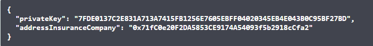
</p>

##### Response

- result- lista contract address policy e address insurance company

[[contract address policy], [address insurance company]]

<p align="center">
  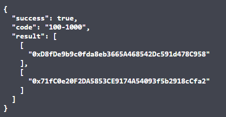
</p>

> **Policy**

Os métodos do Policy precisam ser assinados por address que possuem dentro do smart contract  a permissão de seguradoras. Essa assinatura é chamada de private Key. O admin do smart contract primeiramente precisa adicionar o address da seguradora na role Insuranse Company, a partir daí a seguradorá terá a permissão de alterar o status e consultar apólices utilizando sua private Key.

**POST/policy**

Por meio deste método é possível retornar todas informações da Apólice registrada na Blockchain.  É necessário estar na role Insurance Company.

##### Parameters

- private Key - quem realiza essa transação precisa estar na role “insurance Company“. Essa private key precisa ser de uma seguradora

- contract address - o address do smart contract de Policy que quer recuperar as informações.

<p align="center">
  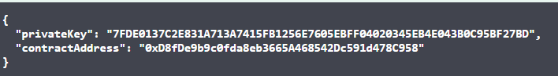
</p>

##### Response

```
{
  "success": true,
  "code": "100-1000",
  "data": {
    "insuranceCompany": [
      "0x71fC0e20F2DA5853CE9174A54093f5b2918cCfa2",
      "0x17cA6A08758F4A078B9c53ca25E6F6736dF34094"
    ],
    "coverages": [
      "1000",
      "5",
      "1",
      1,
      "1",
      "1",
      1,
      1,
      [
        "1",
        "2"
      ]
    ],
    "policyInformation": [
      "1",
      "13334",
      {
        "_hex": "0x5e8d1af4"
      },
      {
        "_hex": "0x606e4e74"
      },
      1
    ],
    "policyHoldedrData": [
      "client",
      {
        "_hex": "0x1d5809f4"
      },
      1,
      "1",
      "11111111111",
      1,
      1
    ],
    "vehicleData": [
      1,
      {
        "_hex": "0x01"
      },
      {
        "_hex": "0x01"
      },
      5,
      2000,
      2001,
      1,
      1,
      3
    ],
    "vehicleDocuments": [
      "11111",
      "1111111111",
      "1111111111",
      1
    ],
    "driverData": [
      "client",
      {
        "_hex": "0x1d5809f4"
      },
      1,
      "1",
      "111111111111",
      1,
      {
        "_hex": "0x01"
      },
      "111111",
      {
        "_hex": "0x38ee7d74"
      },
      1,
      1,
      1
    ]
  }
}
```

<p align="center">
  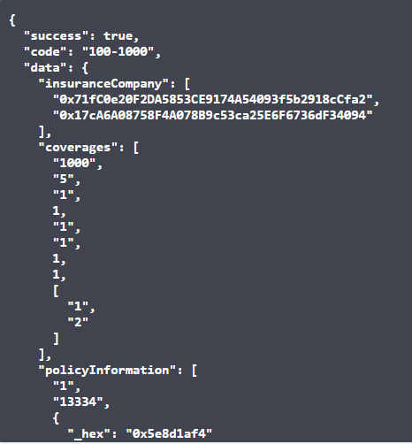
</p>

**PUT/policy**

Por meio deste método é possível alterar o valor do status da apólice na blockchain. É necessário estar na role Insurance Company.

##### Parameters

- private Key - quem realiza essa transação precisa estar na role “insurance Company“. Essa private key precisa ser de uma seguradora

- contract address - o address do smart contract de Policy que quer recuperar as informações.

- status - valor do novo status

:warning:

##### Response

> **Lifecycle**

Os métodos denominados de lifecycle precisam ser assinados por address que possuem dentro do smart contract  a permissão de admin. Essa assinatura é chamada de private Key. Um admin do smart contract primeiramente precisa adicionar o address na role admin, a partir daí terá a permissão de pausar ou ativar o smart contract Policy Factory utilizando sua private Key.

**POST/lifecycle/pause**

Por meio deste método é possível pausar o smart contract a função de criar apólice do Policy Factory. É necessário estar na role Admin.

##### Parameters

:warning:

##### Response

**POST/lifecycle/unpause**

Por meio deste método é possível ativar a função de criar apólice no smart contract Policy Factory. É necessário estar na role Admin.

##### Parameters

:warning:

##### Response

**GET/lifecycle/paused/{contract}**

Por meio deste método é possível verificar o status do smart contract Policy Factory.

##### Parameters

:warning:

##### Response

:warning:

<p align="center">
  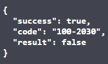
</p>

> **Roles**

Os métodos denominados de roles precisam ser assinados por address que possuem dentro do smart contract  a permissão de admin. Essa assinatura é chamada de **private Key**. Um admin do smart contract primeiramente precisa adicionar o address na role admin, a partir daí terá a permissão de adcionar ou remover address  do smart contract Policy Factory utilizando sua private Key.

**GET/role/admin**

Por meio deste método é possível consultar se um address é administrador no smart contract  Policy Factory.

- address - o endereço da carteira a ser consultada

<p align="center">
  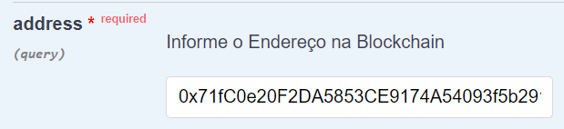
</p>

##### Response

is admin = true

<p align="center">
  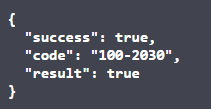
</p>

is admin = false

<p align="center">
  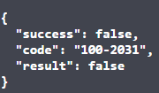
</p>

**POST/role/admin**

Por meio deste método é possível  adicionar um administrador no smart contract Policy Factory. É necessário estar na role Admin.

##### Parameters

- private Key - quem realiza essa transação precisa estar na role “admin“. Essa private key precisa ser de um administrador do smart contract Policy Factory

- address - o endereço da carteira que será adicionada como administrador

<p align="center">
  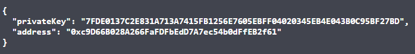
</p>

##### Response

- link - link do Etherscan para a transação efetuada

<p align="center">
  
</p>

<p align="center">
  
</p>

**DELETE/role/admin**

Por meio deste método é possível remover um administrador no smart contract Policy Factory. É necessário estar na role Admin.

##### Parameters

- private Key - quem realiza essa transação precisa estar na role “admin“. Essa private key precisa ser de um administrador do smart contract Policy Factory

- address - o endereço da carteira que será adicionada como administrador

<p align="center">
  
</p>

##### Response

- link - link do Etherscan para a transação efetuada

<p align="center">
  
</p>

<p align="center">
  
</p>

**GET/role/insurance-company**

Por meio deste método é possível consultar se um address está na role de seguradora no smart contract Policy Factory. 

##### Parameters

- addressInsuranceCompany - o endereço da carteira a ser consultada

<p align="center">
  
</p>

##### Response

is InsuranceCompany = true

<p align="center">
  
</p>

is InsuranceCompany = false

<p align="center">
  
</p>

**POST/role/insurance-company**

Por meio deste método é possível adicionar uma seguradora no smart contract Policy Factory. É necessário estar na role Admin.

##### Parameters

- private Key - quem realiza essa transação precisa estar na role “admin“. Essa private key precisa ser de um administrador do smart contract Policy Factory

- addressInsuranceCompany - o endereço da carteira a ser adicionada na role insurance company

<p align="center">
  
</p>

##### Response

- link - link do Etherscan para a transação efetuada

<p align="center">
  
</p>

<p align="center">
  
</p>

**DELETE/role/insurance-company**

Por meio deste método é possível remover uma seguradora do smart contract Policy Factory. É necessário estar na role Admin.

##### Parameters

- private Key - quem realiza essa transação precisa estar na role “admin“. Essa private key precisa ser de um administrador do smart contract Policy Factory

- addressInsuranceCompany - o endereço da carteira a ser adicionada na role insurance company

<p align="center">
  
</p>

##### Response

- link - link do Etherscan para a transação efetuada

<p align="center">
  
</p>

<p align="center">
  
</p>

### Campos apólice

| Categoria | Variavel | Descrição | Type | Exemplo |
| --------- | -------- | --------- | ---- | ------- |
| privateKey | | Chave privada de quem assina a transação (msg.sender) | string | 2BFB60E72FB1C275CEC44446194A1620F22555668647149148593614787C3F00 |
| | | | | |
| Mutual | wallets | Numeros da carteiras de cada seguradora pertencente a apólice. | address[] |  [0x7105d236BdA4Db17666807726D99B70b1da19tau, 0x7105d236BdA4Db17666807726D99B70b1da19qwe, 0x7105d236BdA4Db17666807726D99B70b1da19def] |
| | | | | |
| Coverage | prizeAmount | Valor pago da cobertura | unit256 | 3400 |
| | fipePercentage | Indice da tabela fipe | unit256 | 2% |
| | app | Acidentes Pessoais de Passageiros | string | App1 |
| | glasses | Cobertura de vidro | unit256 | 1 |
| | rcfMaterials | Responsabilidade Civil Facultativa danos Materiais | string | rcfM1 |
| | rcfBodily | Responsabilidade Civil Facultativa danos corporais | string | rcfB1 |
| | reserveCar | Se a cobertura paga possui carro reserva | unit256 | 2 |
| | franchise | Participação obrigatória do segurado em um sinistro | unit256 | 1 |
| | productCoverage | Produto segurado | string[] |  [982001, 90201, 33221] |
| | | | | |
| policyInformation | proposal | Identificação da Proposta que gerou a apólice | string | proposal1 |
| | apolice | Identificação da apólice (interno) | string | policy1 |
| | startValidity | Data de início da vigência | unit256 | 1249052401 |
| | endValidity | Data de fim da vigência | unit256 | 1249052401 | 
| | apoliceStatus | Status da apólice | unit256 | 2 |
| | | | | |
| PolicyHolderData | nameComplete | Nome do segurado | string | client |
| | dateOfBirth | Data nascimento segurado | unit256 | 1249052401 |
| | maritalStatus | Estado civil | unit256 | 1 |
| | pocket | | string | pocket1 |
| | cnpjCpf | CPF / CNPJ | string |  cpf11111111111 |
| | gender | Gênero | unit256 | 2 |
| | relationshipPolicyHolder | Grau de parentesco | unit256 | 1 |
| | | | | |
| VehicleDataModel | typeParam | Tipo do veículo | unit256 | 1 |
| | maker | Marca | unit256 | 234 |
| | model | Modelo | unit256 | 23451 |
| | numerSlides | | unit256 | 5 |
| | yearManufactur | Ano de fabricação | unit256 | 2019 |
| | yearModel | Modelo ano | unit256 | 2020 |
| | licensePlate | Placa | string | ENV4211 |
| | chassis | Chassis | string | 3819920039813B23 |
| | Renavan | Renavan | string | 32441HGS |
| | fuel | Tipo decombustível | unit256 | 1 |
| | newVehicle | Se é veículo zeroKM | unit256 | 1 |
| | vehicleFinaced | Se é financiado | unit256 | 1 |
| | color | Cor | unit256 | 1 |
| | | | | |
| DriverDataModel | nameComplete | Nome do motorista | string | 4CADIA Factory |
| | dateOfBirth | Data de nascimento | unit256 | 1984-01-12 |
| | maritalStatus | Estado civil | unit256 | 1 |
| | pocket | | string | 6140020 |
| | cnpjCpf | CPF / CNPJ | string |  99999999999 |
| | gender | Gênero | unit256 | 1 |
| | profession | Profissão | unit256 | 2341 |
| | cnh | Carteira de Habilitação | string | 3221333211 |
| | dateFirstCnh | Data da primeira carteira de habilitação | unit256 | 2013-02-01 |
| | garage | Se o veículo fica em garagem | unit256 | 1 |
| | usesWork | Se é usado para trabalho | unit256 | 1 |
| | vehicleUse | Tipo de utilização do veículo | unit256 | 2 |

## Manual HBTrust.domain.claims

### Visão Geral

A API HBTrust.domain.Claims fornece os serviços necessários para administrar e executar as funções dos smarts contracts Claim Factory, Claim e Policy Report Factory, Policy Report.

> **Claim Factory**

O smart contract Claim Factory possui as funções de criar smart contract de sinistros (Claim). Para cada sinistro é criado um smart contract, registrando suas  informações na blockchain. Cada smart contract Claim pode executar funções de consulta e alteração do status.

<p align="center">
  
</p>

> **Policy Report Factory**

O smart contract Policy Report Factory possui as funções de criar smart contract de laudos (Policy Report). Para cada laudo é criado um smart contract, registrando suas  informações na blockchain. Cada smart contract Policy Report pode executar funções de consulta e alteração do status.

<p align="center">
  
</p>

### Administração do Smart Contract

O primeiro administrador do smart contract o owner do contrato.  No momento da publicação do smart contract na rede Ethereum, o address de quem está publicanto se torna o owner e esse por sua vez pode adicionar demais admins.

Para administrar os smart contracts é necessário ter uma carteira ethereum. Com o address dessa carteira o owner do contrato pode adicionar essa carteira como administrador do smart contract. 

|   |   |
| - | - |
| owner | O address da carteira que publica o smart contract na rede. Esse address é inserido em todas as roles do smart contract no momento da publicação. |
| carteira | As carteiras permitem que os usuários do Ethereum armazenem o Ether e interajam com contratos inteligentes na rede Ethereum. |
| address | O address Ethereum são identificadores exclusivos derivados de chaves públicas. Private Key -> Public Key -> Ethereum Address |
| smart contracts | Um smart contract é o código da aplicação publicado na rede blockchain do Ethereum. Executa as regras de negócios definidas para a sinistros e laudos. |

### Funções administrativas

As roles em um smart contract definem os papéis realizados por cada entidade. Os smart contracts de sinistro e laudo possuem as roles: Insurance Company e Admin.

#### Admin role

- Responsável por contolar as funções de **adicionar** e **remover** outros admins.

| Método API | Função Smart Contract |
| - | - |
| POST/role/admin | addAdmin |
| DELETE/role/admin | removeAdmin |

- Responsável por controlar as funções de **adicionar** e **remover** seguradoras.

| Método API | Função Smart Contract |
| - | - |
| POST/role/insurance-company | addInsuranceCompany |
| DELETE/role/insurance-company | removeInsuranceCompany |

- Responsável por **pausar / ativar** o smart contract quando necessário

| Método API | Função Smart Contract |
| - | - |
| POST/lifecycle/pause | pause |
| POST/lifecycle/unpause | unpause |

**Insurance Company role**

Essa role dá a permissão para criar sinistros ou laudos, alterar o status de ambos e realizar as consultas.

| Método API | Função Smart Contract |
| - | - |
| POST/insurance-claim | generateClaim |
| PUT/insurance-claim | updateStatusClaim |
| POST/insurance-claim/consult-insuranceCompany-claims | consultInsuranceCompanyClaims |
| POST/insurance-claim​/consult-claims | consultApolice; consultVehicle; consultVehicleLicence; consultConductor; consultOcurrence; consultOcurrenceReport; consultThirdParty; consultClaimInformation; consultClaimInsurance |
| POST/policy-report | generateReport |
| PUT/policy-report | updateStatusReport |
| POST/policy-report/consult-InsuranceCompany-policies-report | consultInsuranceCompanyPoliciesReport |
| POSt/policy-report/consult-policy-report | consultReportInsuranceCompany; consultReportOcurrenceData; consultReportAssistanceData; consultReportTechnicalReport; consultReport; |

### Criar Sinistro e Laudos

Após a publicação do smart contract na rede Ethereum, o owner do contrato que foi adicionado automáticamente na role admin, elege quem será administrador desse smart contract e adiciona o address na role admin. 

Como a API Claim possui tanto o smart contract Insurance Claim quanto o Policy Report, as funções administrativas possuem um parâmetro a mais para selecionar qual o smart contract está sendo chamado. 

!> O parâmetro ```contract``` deve ser preenchido com: ```insurance-claim``` ou ```policy-report```

<p align="center">
  
</p>

Essa função de admin pode controlar quem é adicionado ou removido tanto da função admin quanto da função de insurance company. Então o admin adiciona as seguradoras na role insurance company. Toda seguradora precisa ter uma carteira Ethereum para que o address dessa carteira seja adicionado na role insurance company pelo admin.

<p align="center">
  
</p>

As seguradoras, já com a permissão, ao enviarem os parâmetros para a criação de sinistro ou laudo, a mesma é criada e registrada na blockchain.

<p align="center">
  
</p>

### Executar um método por meio do swagger

|   |   |   |
| - | - | - |
| swagger | | http://hbtrust-claim.4cadia.com/swagger/#/ |
| | |
| Rinkeby | Claim |https://rinkeby.etherscan.io/address/0x74c64cd873c8f89d9e114caf38e5c9def51f6319 |
| | Report | https://rinkeby.etherscan.io/address/0x2896149d197a0f9081d14c8e15799c357d5be5fc |

Na página do swagger você pode selecionar um método GET/POST/PUT e clicar no botão **try it out**.

Os métodos GET podem ser executados com a introdução dos parâmetros nos campos requisitados.

Já os métodos POST/PUT podem ser executados com a edição do body com os parâmetros necessários.

Após a edição clique em **Execute** e o método será executado.

### Métodos

?>  Insurance Claim Factory

Os métodos do Insurance Claim Factory precisam ser assinados por address que possuem dentro do smart contract  a permissão de seguradoras. Essa assinatura é chamada de private Key. O admin do smart contract primeiramente precisa adicionar o address da seguradora na role Insuranse Company, a partir daí a seguradora terá a permissão de criar sinistros e consultar-los utilizando sua private Key.

**POST/insurance-claim**

Por meio deste método é possível  criar e registrar um sinistro na blockchain. É necessário estar na role Insurance Company.

##### Requisição

- private Key - quem realiza essa transação precisa estar na role “insurance Company“. Essa private key precisa ser de uma seguradora

- insurance Company - os address das seguradoras que participam dessa sinistro.

- Campos: 

```
{
	"privateKey":"A9AC29CBEB110215AE6D5AF5D8731A848160A3A7DABEF198B832A38D4B4385E2",
	"insuranceCompany":{
		"wallets":[
			"0x09c15427Fed859ed46AFFB996bCd62f3b9180137"
			]
	},
	"apoliceData": {
		"apolice":"123456",
		"start_validity":"2020-01-01",
		"end_validity":"2020-01-02",
		"apolice_status":"1"
	},
	"claimInformation":{
		"claim": "123456",
		"claimStatus":"1"
	},
	"conductorData":{
		"name_complete":"client",
		"date_of_birth":"2020-01-01",
		"marital_status":"1",
		"cnpj_cpf":"11111111111",
		"gender":"1",
		"profession":"dev",
		"cnh":"1234567890",
		"category_cnh":"b",
		"date_validate_cnh":"2020-03-01"
	},
	"ocurrenceData":{
		"claim_number": "123456",
		"date_occurrence":"2020-10-01",
		"time_occurrence":"13:00",
		"place_occurrence":"place",
		"police_report":"678767",
		"protocol_police_report":"1",
		"conductor_guilty_occurrence":"1",
		"ocurrence_description": "111111",
		"victims":"1",
		"damage_victims":"1",
		"damage_vehicle":"1"
	},
	"thirdPartyData":{
		"involvement_3rd":"2",
		"how_many_involvement":"3",
		"licenses_plates": ["aaa1234"],
		"damage_caused":"none"
	},
	"vehicleData":{
		"vehicle_type":"auto",
        "maker": "ford",
        "model":"ka",
        "numer_slides":"5",
        "year_manufacture":"2010",
        "year_model":"2011",
        "license_plate":"1",
        "chassis":"11111A1111",
        "renavam":"11111N1111",
        "fuel":"1"
	}
}
```

<p align="center">
  
</p>

##### Response 

- link - link do Etherscan para a transação efetuada 

<p align="center">
  
</p>

**POST/insurance-claim/consult-insuranceCompany-claims**

Por meio deste método é possível listar todas os sinistros e  seguradoras (owners dos sinistros) registradas na Blockchain. É necessário estar na role Insurance Company.

##### Requisição

- private Key - quem realiza essa transação precisa estar na role “insurance Company“. Essa private key precisa ser de uma seguradora

- insurance Company - os address das seguradoras que participam dessa sinistro. 

<p align="center">
  
</p>

##### Response

- data - lista contract address insurance claim e address insurance company

[[contract address insurance claim], [address insurance company]]

<p align="center">
  
</p>

?> Insurance Claim

Os métodos do Insurance Claim precisam ser assinados por address que possuem dentro do smart contract  a permissão de seguradoras. Essa assinatura é chamada de private Key. O admin do smart contract primeiramente precisa adicionar o address da seguradora na role Insuranse Company, a partir daí a seguradorá terá a permissão de alterar o status e consultar os sinistros utilizando sua private Key.

**POST/insurance-claim​/consult-claims**

Por meio deste método é possível retornar todas informações do Sinistro registrados  na Blockchain.  É necessário estar na role Insurance Company.

- private Key - quem realiza essa transação precisa estar na role “insurance Company“. Essa private key precisa ser de uma seguradora

- contract address - o address do smart contract de Insurance Claim que quer recuperar as informações.

<p align="center">
  
</p>

##### Response

```
{
  "success": true,
  "code": "100-1000",
  "message": "sucess",
  "data": {
    "apoliceData": [
      {
        "_hex": "0x01e240"
      },
      "2020-01-01",
      "2020-01-02",
      {
        "_hex": "0x01"
      }
    ],
    "claimInformation": [
      {
        "_hex": "0x01e240"
      },
      "23"
    ],
    "conductorData": [
      "client",
      "2020-01-01",
      {
        "_hex": "0x01"
      },
      {
        "_hex": "0x02964619c7"
      },
      {
        "_hex": "0x01"
      },
      "dev",
      {
        "_hex": "0x499602d2"
      },
      "b",
      "2020-03-01"
    ],
    "occurenceData": [
      {
        "_hex": "0x01e240"
      },
      "2020-10-01",
      "13:00",
      "place"
    ],
    "occurenceReport": [
      {
        "_hex": "0x0a5b6f"
      },
      {
        "_hex": "0x01"
      },
      {
        "_hex": "0x01"
      },
      {
        "_hex": "0x01b207"
      },
      {
        "_hex": "0x01"
      },
      "1",
      "1"
    ],
    "thirdPartyData": [
      {
        "_hex": "0x02"
      },
      {
        "_hex": "0x03"
      },
      [
        "aaa1234"
      ],
      "none"
    ],
    "vehicleData": [
      "auto",
      "ford",
      "ka",
      {
        "_hex": "0x05"
      },
      {
        "_hex": "0x07da"
      },
      {
        "_hex": "0x07db"
      },
      {
        "_hex": "0x01"
      }
    ],
    "vehicleLicense": [
      "1",
      "11111A1111",
      "11111N1111"
    ]
  }
}
```

<p align="center">
  
</p>

**PUT/insurance-claim**

Por meio deste método é possível alterar o valor do status do sinistro na blockchain. É necessário estar na role Insurance Company.

##### Requisição

- private Key - quem realiza essa transação precisa estar na role “insurance Company“. Essa private key precisa ser de uma seguradora

- contract address - o address do smart contract de Insurance Claim que quer recuperar as informações.

- status - valor do novo status

<p align="center">
  
</p>

##### Response

- link - link do Etherscan para a transação efetuada 

<p align="center">
  
</p>

?> **Policy Report Factory**

Os métodos do Policy Report Factory precisam ser assinados por address que possuem dentro do smart contract  a permissão de seguradoras. Essa assinatura é chamada de private Key. O admin do smart contract primeiramente precisa adicionar o address da seguradora na role Insuranse Company, a partir daí a seguradora terá a permissão de criar laudos e consultar-los utilizando sua private Key.

**POST/policy-report**

Por meio deste método é possível  criar e registrar um laudo na blockchain. É necessário estar na role Insurance Company.

##### Requisição

- private Key - quem realiza essa transação precisa estar na role “insurance Company“. Essa private key precisa ser de uma seguradora

- insurance Company - os address das seguradoras que participam dessa sinistro.

- Campos: 

```
{
	"privateKey":"A9AC29CBEB110215AE6D5AF5D8731A848160A3A7DABEF198B832A38D4B4385E2",
	"insuranceCompany": {
        "wallets": ["0x09c15427Fed859ed46AFFB996bCd62f3b9180137"]
    },
    "occurrenceData": {
        "claimNumber": "321123",
        "dateOcurrence": "1585084539000",
        "timeOcurrence": "1585084539000",
        "placeOcurrence": "Avenida Paulista,1392",
        "policeReport": "1",
        "protocolPoliceReport": "321344",
        "conductorGuiltyOccurrence": "1",
        "ocurrenceDescription": "3221333211",
        "victims": "1",
        "damageVictims": "Houve danos das vitimas descrição",
        "damageVehicle": "Relato dos danos causados no veiculo"
    },
    "assistanceData": {
        "cnpjCpf": "99999999999",
        "nameComplete": "Assistencia tecnica"
    },
        "technicalReport": {
        "reportNumber": "252415",
        "reportStatus": "2",
        "damageComponents": ["2", "1", "32"]
    },
    "manpower": "Descrição da mão de obra",
    "technicalAdvice": "Relato do parecer técnico"
}
```

<p align="center">
  
</p>

##### Response

- link - link do Etherscan para a transação efetuada 

<p align="center">
  
</p>

**POST/policy-report/consult-InsuranceCompany-policies-report**

Por meio deste método é possível listar todas os laudos e  seguradoras (owners dos laudos) registradas na Blockchain. É necessário estar na role Insurance Company.

##### Requisição

- private Key - quem realiza essa transação precisa estar na role “insurance Company“. Essa private key precisa ser de uma seguradora

- insurance Company - os address das seguradoras que participam desse laudo. 

<p align="center">
  
</p>

##### Response

- data - lista contract address policy report e address insurance company

[[contract address policy report], [address insurance company]]

<p align="center">
  
</p>

?> Policy Report

Os métodos doPolicy Report precisam ser assinados por address que possuem dentro do smart contract  a permissão de seguradoras. Essa assinatura é chamada de private Key. O admin do smart contract primeiramente precisa adicionar o address da seguradora na role Insuranse Company, a partir daí a seguradorá terá a permissão de alterar o status e consultar os laudos utilizando sua private Key.

**POST/policy-report/consult-policy-report**

Por meio deste método é possível retornar todas informações do laudos registrados  na Blockchain.  É necessário estar na role Insurance Company.

##### Requisição

- private Key - quem realiza essa transação precisa estar na role “insurance Company“. Essa private key precisa ser de uma seguradora

- contract address - o contract address do Policy Report que quer recuperar as informações.

<p align="center">
  
</p>

##### Response

```
{
  "success": true,
  "code": "100-1000",
  "result": {
    "report": [
      "Descrição da mão de obra",
      "Relato do parecer técnico"
    ],
    "insuranceCompany": [
      "0xD8c9193b73d43c3d0BcBFf53DF7F35B27CE9fbB7"
    ],
    "occurence": [
      "123456",
      {
        "_hex": "0x01710e66a078"
      },
      {
        "_hex": "0x01710e66a078"
      },
      "Avenida Paulista,1392",
      "1",
      "321344",
      "1",
      "3221333211",
      "1",
      "Houve danos das vitimas descrição",
      "Relato dos danos causados no veiculo"
    ],
    "assistanceData": [
      "99999999999",
      "Assistencia tecnica"
    ],
    "technicalReport": [
      "252415",
      "2",
      [
        "2",
        "1",
        "32"
      ]
    ]
  }
}
```

**PUT/policy-report**

Por meio deste método é possível alterar o valor do status do laudo na blockchain. É necessário estar na role Insurance Company.

##### Requisição

- private Key - quem realiza essa transação precisa estar na role “insurance Company“. Essa private key precisa ser de uma seguradora

- contract address - o address do smart contract de Policy Report que quer recuperar as informações.

- status - valor do novo status

<p align="center">
  
</p>

##### Response

- link - link do Etherscan para a transação efetuada 

<p align="center">
  
</p>

?> Lifecycle

Os métodos denominados de lifecycle precisam ser assinados por address que possuem dentro do smart contract  a permissão de admin. Essa assinatura é chamada de private Key. Um admin do smart contract primeiramente precisa adicionar o address na role admin, a partir daí terá a permissão de pausar ou ativar os smart contracts Insurance Claim Factory e Policy Report Factory utilizando sua private Key.

**POST/lifecycle/pause**

Por meio deste método é possível pausar os smart contracts Insurance Claim e Policy Report. É necessário estar na role Admin.

##### Requisição

private Key - quem realiza essa transação precisa estar na role “admin“. Essa private key precisa ser de um administrador do smart contract selecionado

contract - colocar o nome do contrato: insurance-claim ou policy-report

!> O parâmetro ```contract``` deve ser preenchido com: ```insurance-claim``` ou ```policy-report```

<p align="center">
  
</p>

##### Response

<p align="center">
  
</p>

**POST/lifecycle/unpause**

Por meio deste método é possível ativar  os smart contracts Insurance Claim e Policy Report. É necessário estar na role Admin.

##### Requisição

private Key - quem realiza essa transação precisa estar na role “admin“. Essa private key precisa ser de um administrador do smart contract selecionado

contract - colocar o nome do contrato: insurance-claim ou policy-report

!> O parâmetro ```contract``` deve ser preenchido com: ```insurance-claim``` ou ```policy-report```

<p align="center">
  
</p>

##### Response

<p align="center">
  
</p>

**GET/lifecycle/paused/{contract}**

Por meio deste método é possível verificar o status do smart contract Policy Factory.

##### Requisição

!> O parâmetro ```contract deve ser preenchido com: insurance-claim ou policy-report

<p align="center">
  
</p>

##### Response

<p align="center">
  
</p>

> **Roles**

Os métodos denominados de roles precisam ser assinados por address que possuem dentro do smart contract  a permissão de admin. Essa assinatura é chamada de private Key. Um admin do smart contract primeiramente precisa adicionar o address na role admin, a partir daí terá a permissão de adcionar ou remover address dos smart contracts Insurance Claim Factory e Policy Report Factory utilizando sua private Key.

**GET/role/admin**

Por meio deste método é possível consultar se um address é administrador no smart contract   Insurance Claim Factory ou Policy Report Factory .

##### Requisição

- contract - colocar o nome do contrato: insurance-claim ou policy-report

- address - o endereço da carteira a ser consultada

!> O parâmetro ```contract``` deve ser preenchido com: ```insurance-claim``` ou ```policy-report```

<p align="center">
  
</p>

##### Response

- isAdmin é igual a true se o address estiver na role admin, caso contrário é igual a false.

- contract - nome do smart contract referente a solicitação de consulta.

<p align="center">
  
</p>

**POST/role/admin**

Por meio deste método é possível  adicionar um administrador no smart contract  Insurance Claim Factory ou Policy Report Factory . É necessário estar na role Admin.

##### Requisição

- private Key - quem realiza essa transação precisa estar na role “admin“. Essa private key precisa ser de um administrador do smart contract selecionado

- address - o endereço da carteira que será adicionada como administrador

- contract  - colocar o nome do contrato: insurance-claim ou policy-report

!> O parâmetro ```contract``` deve ser preenchido com: ```insurance-claim``` ou ```policy-report```

<p align="center">
  
</p>

##### Response

- link - link do Etherscan para a transação efetuada :warning: 

**DELETE/role/admin**

Por meio deste método é possível remover um administrador no smart contract Insurance Claim Factory ou Policy Report Factory. É necessário estar na role Admin.

##### Requisição

- private Key - quem realiza essa transação precisa estar na role “admin“. Essa private key precisa ser de um administrador do smart contract selecionado

- address - o endereço da carteira que será adicionada como administrador

- contract  - colocar o nome do contrato: insurance-claim ou policy-report

!> O parâmetro ```contract``` deve ser preenchido com: ```insurance-claim``` ou ```policy-report```

<p align="center">
  
</p>

##### Response

- link - link do Etherscan para a transação efetuada :warning: 

**GET/role/insurance-company**

Por meio deste método é possível consultar se um address está na role de seguradora no smart contract Insurance Claim ou Policy Report. 

##### Requisição

- contract - colocar o nome do contrato: insurance-claim ou policy-report

- address - o endereço da carteira a ser consultada

!> O parâmetro ```contract``` deve ser preenchido com: ```insurance-claim``` ou ```policy-report```

<p align="center">
  
</p>

##### Response 

- isInsuranceCompany é igual a true se o address estiver na role insurance company, caso contrário é igual a false.

- contract - nome do smart contract referente a solicitação de consulta.

<p align="center">
  
</p>

**POST/role/insurance-company**

Por meio deste método é possível adicionar uma seguradora no smart contract Insurance Claim Factory ou Policy Report Factory. É necessário estar na role Admin.

##### Requisição

- private Key - quem realiza essa transação precisa estar na role “insurance-company“. Essa private key precisa ser de um administrador do smart contract selecionado

- address - o endereço da carteira que será adicionada como administrador

- contract  - colocar o nome do contrato: insurance-claim ou policy-report

!> O parâmetro ```contract``` deve ser preenchido com: ```insurance-claim``` ou ```policy-report```

<p align="center">
  
</p>

##### Response

- link - link do Etherscan para a transação efetuada :warning: 

**DELETE/role/insurance-company**

Por meio deste método é possível remover uma seguradora do smart contract Insurance Claim Factory ou Policy Report Factory. É necessário estar na role Admin.

##### Requisição

- private Key - quem realiza essa transação precisa estar na role “insurance-company“. Essa private key precisa ser de um administrador do smart contract selecionado

- address - o endereço da carteira que será adicionada como administrador

- contract  - colocar o nome do contrato: insurance-claim ou policy-report

!> O parâmetro ```contract``` deve ser preenchido com: ```insurance-claim``` ou ```policy-report```

<p align="center">
  
</p>

##### Response

- link - link do Etherscan para a transação efetuada :warning:

### Campos sinistro e laudo

**Insurance claim**

| Categoria | Variavel | Descrição | Type | Exemplo |
| --------- | -------- | --------- | ---- | ------- |
| privateKey | | Chave privada de quem assina a transação (msg.sender) | string | A9AC29CBEB110215AE6D5AF5D8731A848160A3A7DABEF198B832A38D4B4385E2 |
| | | | | |
| mutual | wallets | Numeros da carteiras de cada seguradora pertencente ao sinistro. | string | [0x09c15427Fed859ed46AFFB996bCd62f3b9180137] |
| | | | | |
| apoliceData | apolice | Identificação da apólice (interno) | unit256 | 123456 |
| | start_validity | Data de início da vigência | unit256 | 01/01/2020 |
| | end_validity | Data de fim da vigência | unit256 | 02/01/2020 |
| | apolice_status | Status da apólice | unit256 | 1 |
| | | | | |
| claimInformation | claim | Identificação do sinistro (interno) | string | 123456 |
| | claimStatus | Status do sinistro | unit256 | 1 |
| | | | | |
| conductorData | name_complete | Nome do motorista | string | client |
| | date_of_birth | Data de nascimento | string | 01/01/2020 |
| | marital_status | Estado civil | unit256 | 1 |
| | cnpj_cpf | CPF / CNPJ | string | 11111111111 |
| | gender | Gênero | unit256 | 1 |
| | profession | Profissão | unit256 | dev |
| | cnh | Carteira de Habilitação | unit256 | 1234567890 |
| | category_cnh | Categoria da carteira de habilitação | string | b |
| | date_validate_cnh | Data da validade da carteira de habilitação | string | 01/03/2020 |
| | | | | |
| ocurrenceData | claim_number | Numero do sinistro (interno) | unit256 | 123456 |
| | date_occurrence | Data da ocorrência do sinistro | string | 01/10/2020 |
| | time_occurrence | Horário da ocorrência do sinistro. | string | 13 |
| | place_occurrence | Local da ocorrência do sinistro | string | place |
| | police_report | Laudo da polícia | unit256 | 678767 |
| | protocol_police_report | Protocolo do laudo policial | unit256 | 1 |
| | conductor_guilty_occurrence | Condutor no momento da ocorrência | unit256 | 1 |
| | ocurrence_description | Descrição da ocorrência | string | adc |
| | victims | Quantidade de vítimas | unit256 | 1 |
| | damage_victims | Descrição dos danos causados nas vítimas | unit256 | 1 |
| | damage_vehicle | Descrição dos danos causados no veículo | unit256 | 1 |
| | | | | |
| thirdPartyData | involvement_3rd | | unit256 | 2 |
| | how_many_involvement | | unit256 | 3 |
| | licenses_plates | | string[] | [aaa1234] |
| | damage_caused | | string | none |
| | | | | |
| vehicleData | vehicle_type | Tipo do veículo | uint256 | 1 |
| | maker | Marca | unit256 | 4 |
| | model | Modelo | unit256 | 19 |
| | numer_slides | | unit256 | 5 |
| | year_manufacture | Ano de fabricação | unit256 | 2010 |
| | year_model | Modelo ano | unit256 | 2011 |
| | license_plate | Placa | string | 1 |
| | chassis | Chassis | string | 11111A1111 |
| | renavam | Renavan | string | 11111N1111 |
| | fuel | Tipo decombustível | unit256 | 1 |

**policy report**

| Categoria | Variavel | Descrição | Type | Exemplo |
| --------- | -------- | --------- | ---- | ------- |
| privateKey | | Chave privada de quem assina a transação (msg.sender) | string | A9AC29CBEB110215AE6D5AF5D8731A848160A3A7DABEF198B832A38D4B4385E2 |
| | | | | |
| mutual | wallets | Numeros da carteiras de cada seguradora pertencente ao sinistro. | string | [0x09c15427Fed859ed46AFFB996bCd62f3b9180137] |
| | | | | |
| occurrenceData | claimNumber | Identificação do sinistro (interno) | string | 321123 |
| | dateOcurrence | Data de ocorrência | unit256 | 1585084539000 |
| | timeOcurrence | Horario da ocorrência | unit256 | 1585084539000 |
| | placeOcurrence | Localização da ocorrencia | string | Avenida Paulista1392 |
| | policeReport | Relatório policial | unit256 | 121 |
| | protocolPoliceReport | Identificação do protocolo do laudo policial | unit256 | 321344 |
| | conductorGuiltyOccurrence | Condutor no momento da ocorrência | unit256 | 1 |
| | ocurrenceDescription | Descrição da ocorrência | string | dsad11 |
| | victims | Quantidade de vítimas | unit256 | 1 |
| | damageVictims | Descrição dos danos causados nas vítimas | string | Houve danos das vitimas descrição |
| | damageVehicle | Descrição dos danos causados no veículo | string | Relato dos danos causados no veiculo |
| | | | | |
| assistanceData | cnpjCpf | CPF/CNPJ | string | 99999999999 |
| | nameComplete | Nome Completo da assistência técnica | string | Assistencia tecnica |
| | | | | |
| technicalReport | reportNumber | Identificação do laudo (interna) | string | 252415 |
| | reportStatus | Status do laudo | unit256 | 2 |
| | damageComponents | Componentes danificados | string[] | [2, 1, 32] |
| | manpower | Descrição da mão de obra | string | Descrição da mão de obra |
| | technicalAdvice | Relato do parecer técnico | string | Relato do parecer técnico |

## Manual HBTrust.domain.token

### Visão Geral

A API HBTrust.domain.token fornece os serviços necessários para administrar e executar as funções do smart contract do Token HBT, além da geração de wallets Ethereum e consulta de saldo em Ether.

> **Token HBT**

API possui os serviços de gestão do token HBT: gerenciamento das roles de Minter, Burner e Admin (adicionar, remover e consultar), gerenciamento do Total Supply de token HBT (mint token HBT, burn token HBT) além de consulta de saldo de token HBT.

> **Generate Wallet**

API possui a o algoritmo de geração de um **Address**, uma **Private Key** e uma **Seed Phrase (mnemonic)** baseados em um ou mais **parâmetros de entrada**.

<p align="center">
  
</p>

### Administração do Token

Para administrar oToken HBT é necessário ter uma carteira Ethereum. Com o address dessa carteira o owner do contrato pode adicionar essa carteira como administrador do smart contract Token HBT.

|   |   |
| - | - |
| owner | O address da carteira que publica o smart contract na rede. Esse address é inserido em todas as roles do smart contract no momento da publicação. |
| carteira | As carteiras permitem que os usuários do Ethereum armazenem o Ether e interajam com contratos inteligentes na rede Ethereum. |
| address | O address Ethereum são identificadores exclusivos derivados de chaves públicas. Private Key -> Public Key -> Ethereum Address |
| smart contract | Um smart contract é o código da aplicação publicado na rede blockchain do Ethereum. Executa as regras de negócios definidas para o Token. |
| token | São ativos digitais desenvolvidos na Blockchain Ethereum. |
| Total Supply | A quantidade total de Tokens que estão alocados no smart contract independente do proprietário. |

### Funções administrativas

As roles definem os papéis realizados por cada entidade. 

#### Admin role

- Address da carteira responsável por contolar as funções de **adicionar** e **remover** das roles de minter, burner e admin.

| Método API | Função Smart Contract |
| - | - |
| POST / Add Role | ```addAdmin, addMinter, addBurner``` |
| POST / Remove Role | ```removeAdmin, removeMinter , removeBurner``` |

<p align="center">
  
</p>

#### Minter Role

- Address da carteira responsável por cunhar (criar) novos Tokens HBT. Cada novo Token criado é somado ao Total Supply.

| Método API | Função Smart Contract |
| - | - |
| POST / Mint To | mintTo |

<p align="center">
  
</p>

#### Burner Role

- Address da carteira responsável por eliminar Tokens HBT. Cada Token “queimado“ é subtrído do Total Supply.

| Método API | Função Smart Contract |
| - | - |
| POST / Burn From | burnFrom |

<p align="center">
  
</p>

### Funções Gerais

#### Token HBT

- Dado o address do remetente da função (msg.sender) este pode tranferir tokens HBT da sua carteira para uma segunda carteira e consultar o saldo em token HBT.

| Método API | Função Smart Contract |
| - | - |
| POST / Transfer | transfer |
| GET / Balance | balanceOf |

#### Ethereum

POST / Generate Wallet

- Método utulizado para a geração das carteiras Ethereum:

|   |   |
| - | - |
| **BIP-39** | para a geração do Address e da Seed Phrase. |
| **HDKey** | para a geração da Private Key. |
| **ETHUtil** | para transformação do Address. |
| **Web3** | para teste das Carteiras. |

GET / Balance Ether

- Dado o address do remetente da função (msg.sender) este pode visualisar o saldo em Ether de sua carteira.

### Executar um método por meio do swagger

|   |   |
| - | - |
| swagger | http://hbtrust-token.4cadia.com/swagger/#/ |
| Rinkeby | https://rinkeby.etherscan.io/address/0x5a093dd37b635f4ae8d9b3be65d3f4e7b3dd187c |

Na página do swagger você pode selecionar um método GET/POST/PUT e clicar no botão **try it out**.

Os métodos GET podem ser executados com a introdução dos parâmetros nos campos requisitados.

Já os métodos POST/PUT podem ser executados com a edição do body com os parâmetros necessários.

Após a edição clique em **Execute** e o método será executado.

| MÉTODO | DESCRIÇÃO |
| - | - |
| **POST** | O método HTTP ```POST``` é utilizado na criação dos recursos ou no envio de informações que serão processadas. Por exemplo, mint tokens, adicionar um address a uma role. |
| **GET** | O método HTTP ```GET``` é utilizado para consultas de recursos já existentes. Por exemplo, consulta de roles. |

### Métodos

> **Role**

**GET /verify-role/{address}**

Por meio deste método é possível verificar em qual role um address pertence (admin, minter ou burner).

##### Requisição

- Informar no PATH o address da wallet que está sendo verificada

<p align="center">
  
</p>

##### Response

- Retorna true / false para cada role

<p align="center">
  
</p>

**POST/add-role**

Os métodos denominados de roles precisam ser assinados por address que possuem dentro do smart contract do Token a permissão de admin. Essa assinatura é chamada de **private Key**. 

Por meio deste método é possível adicionar um address em uma das roles: Admin, Minter ou Burner. 

##### Requisição

- Private Key - quem realiza essa transação precisa estar na role “admin“. Essa private key precisa ser de um administrador do smart contract Token HBT

- sender - address do admin do smart contract Token HBT

- account - address da carteira que será adicionada na role

- role - nome da role: admin, burner ou minter

<p align="center">
  
</p>

##### Response

- link - link do Etherscan para a transação efetuada

<p align="center">
  
</p>

**POST/remove-role**

Os métodos denominados de roles precisam ser assinados por address que possuem dentro do smart contract do Token a permissão de admin. Essa assinatura é chamada de **private Key**. 

Por meio deste método é possível remover um address de uma das roles: Admin, Minter ou Burner. 

##### Requisição

- Private Key - quem realiza essa transação precisa estar na role “admin“. Essa private key precisa ser de um administrador do smart contract Token HBT

- sender - address do admin do smart contract Token HBT

- account - address da carteira que será adicionada na role

- role - nome da role: admin, burner ou minter

<p align="center">
  
</p>

##### Response

- link - link do Etherscan para a transação efetuada :warning: 

<p align="center">
  
</p>

> **Mint Token HBT**

**POST/mintTo**

Por meio deste método é possível mintar, ou seja, criar HBT Tokens em uma wallet.

Esse método precisa  ser assinado por address que possue dentro do smart contract do Token a permissão de minter. Essa assinatura é chamada de **private Key**.

##### Requisição

- Private Key - quem realiza essa transação precisa estar na role “minter“. Essa private key precisa ser de um minter do smart contract Token HBT

- sender - address do minter do smart contract Token HBT

- account - address da carteira que receberá os Tokens HBT

- amount- quantidade de tokens HBT que serão criados.

<p align="center">
  
</p>

##### Response

- link - link do Etherscan para a transação efetuada 

<p align="center">
  
</p>

> **Burn Token HBT**

**POST/burnFrom**

Por meio deste método é possível queimar tokens, ou seja, destruir HBT Tokens de uma wallet.

Esse método precisa ser assinado por address que possue dentro do smart contract do Token a permissão de burner. Essa assinatura é chamada de **private Key**. 

##### Requisição

- Private Key - quem realiza essa transação precisa estar na role “burner“. Essa private key precisa ser de um burner do smart contract Token HBT

- sender - address do burner do smart contract Token HBT

- account - address da carteira que terá os Tokens HBT eliminados

- amount- quantidade de tokens HBT que serão eliminados.

<p align="center">
  
</p>

##### Response

- link - link do Etherscan para a transação efetuada

<p align="center">
  
</p>

> **Tranfer**

**POST/transfer**

Por meio deste método é possível transferir HBT Tokens de uma wallet para outra.

##### Requisição

- Private Key - quem realiza a transação de tranferência (o remetente). 

- sender - address remetente dos tokens HBT

- account - address da carteira que receberá os tokens HBT

- amount- quantidade de tokens HBT que serão enviados.

<p align="center">
  
</p>

##### Response

- link - link do Etherscan para a transação efetuada

<p align="center">
  
</p>

> **Tranfer**

**POST/transfer**

Por meio deste método é possível transferir HBT Tokens de uma wallet para outra.

##### Requisição

- Private Key - quem realiza a transação de tranferência (o remetente). 

- sender - address remetente dos tokens HBT

- account - address da carteira que receberá os tokens HBT

- amount- quantidade de tokens HBT que serão enviados.

<p align="center">
  
</p>

##### Response

- link - link do Etherscan para a transação efetuada

<p align="center">
  
</p>

> **Balance**

**GET/balance/{owner}**

Por meio deste método é possível verificar a quantidade de HBT Token de uma wallet.

##### Requisição

- address - da carteira a ser consultada

<p align="center">
  
</p>

##### Response 

balance - quantidade de tokens HBT

<p align="center">
  
</p>

**GET/balanceEther/{owner}**

Por meio deste método é possível verificar a quantidade de Ether de uma wallet.

##### Requisição

- address - da carteira a ser consultada

<p align="center">
  
</p>

##### Response 

balance - quantidade de Ether

<p align="center">
  
</p>

> **Generate Wallet**

**POST/generate-wallets**

Por meio deste método é possível criar Wallets.

##### Requisição

- quantity - quantidade de wallets que serão criadas

<p align="center">
  
</p>

###### Response

- index - ordenação da wallet gerada

- mnemonic - grupo de palavras que dão acesso a wallet. Precisa ser tratada como sua private key pois com o mnemonic qualquer um pode acessar sua carteira

- address - o endereço da sua carteira

- private Key - sua assinatura para transações feitas no Ethereum

<p align="center">
  
</p>