# Frontend

## HBTrust.Admin.FrontEnd

### Visão Geral

Aplicação que disponibilize as consultas relacionadas abaixo:

- quantidade de apólices por seguradora

- quantidade de sinistros por seguradora

- quantidade de sinistros que possuam laudo por seguradora

- relação de tokens mintados

Todos os grids com filtro de período de data e opção para exportar em PDF.

A aplicação precisa ter um usuário administrador que possua um address na role insurance company nos smart contracts Policy Factory, Claim Factory e Policy Report Factory.

?> **Filtros e campos de pesquisa**

- campo seguradora - recebe o address da seguradora. Para ter uma seleção de seguradoras por nome é preciso ter a relação seguradora/address off-chain.

- filtros - filtrar por período de data (query antes de exibir para consolidar o resultado)

- botão pesquisar

  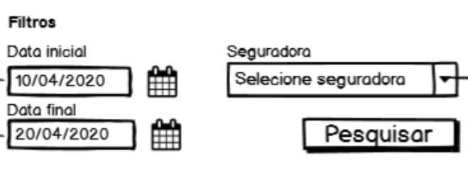

  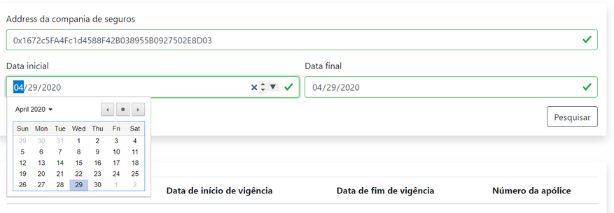

?> **Apólice**

É necessário fornecer um address válido da companhia de seguros.
O resultado analítico retorna todas as apólices da seguradora juntamente com o número da apólice.
O resultado consolidado retorna a soma de todas as apólices criadas pela seguradora separadas por data.

  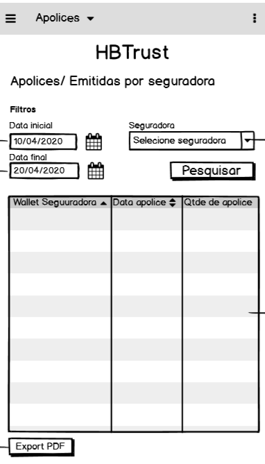

| Tipo Pesquisa | Descrição | Campos | |
| - | - | :-: | :-: |
| Analítico | O resultado analítico retorna cada apólice juntamente com o seu número para a seguradora pesquisada. | 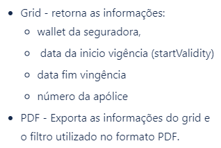 | 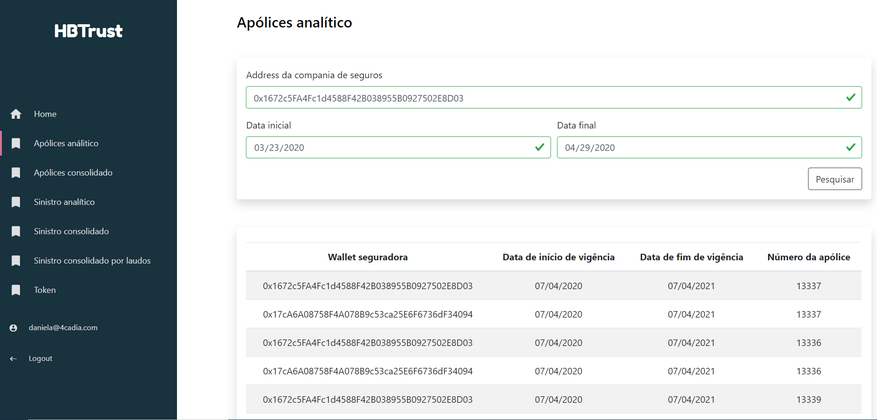 | 
| Consolidado | O resultado consolidado retorna a quantidade de apólices criadas por dia para a seguradora pesquisada. | 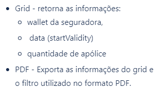 | 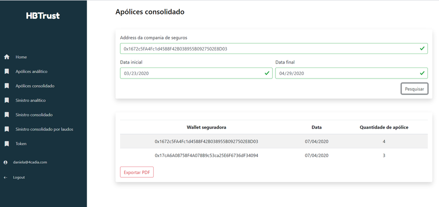 |

?> **Sinistro**

É necessário fornecer um address válido da companhia de seguros.
O resultado analítico retorna todos os sinistros da seguradora juntamente com o número do sinistro.

O resultado consolidado retorna a soma de todos os sinistros criados pela seguradora separados por data.

  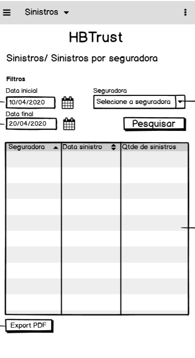

| Tipo Pesquisa | Descrição | Campos | |
| - | - | :-: | :-: |
| Analítico | O resultado analítico retorna todos os sinistros da seguradora juntamente com o número do sinistro. |  | 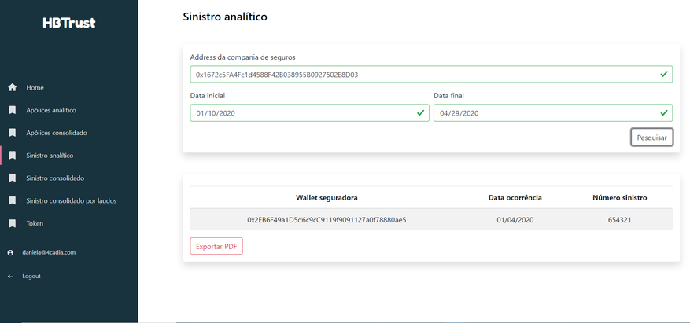 |
| Consolidado | O resultado consolidado retorna a quantidade de sinistros criados por dia para a seguradora pesquisada. | 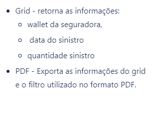 | 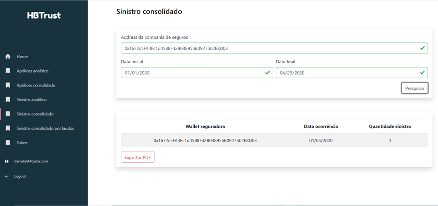 |

?> **Sinistros com Laudo**

O resultado consolidado para laudos retorna a soma de todos os sinistros que possuem laudo separados por data.

  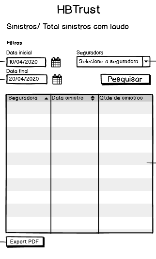

| Tipo Pesquisa | Descrição | Campos | |
| - | - | :-: | :-: |
| Consolidado | O resultado consolidado retorna a quantidade de sinistros criados e que possuem laudo para a seguradora pesquisada. | 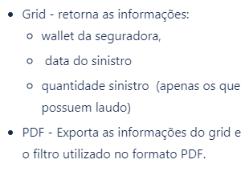 | 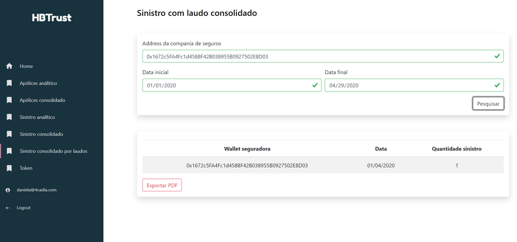 |

?> **Token**

Forneça um address válido para poder ver o saldo disponivel em HBT.

- Campo address

- Campo balace - exibe a quantidade de tokens HBT para o address pesquisado.

  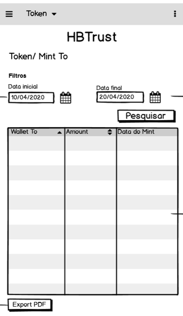

  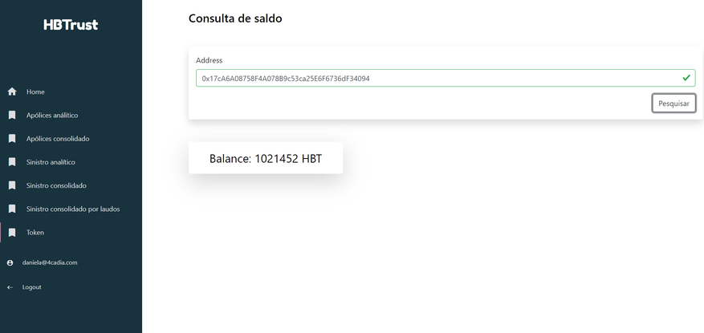

