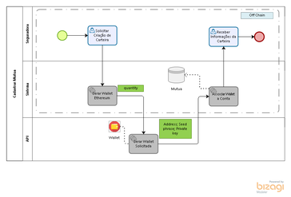
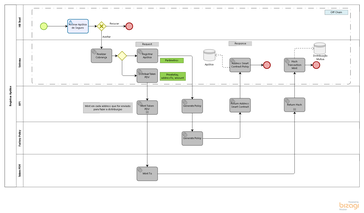
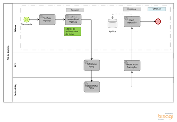
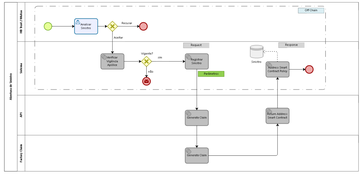

# Process Mechanics

## Process Mechanics - Token

#### Cadastro de Mútua

Toda mútua precisa ter uma Ethereum Wallet. 

API do token fornece o serviço de geraração de wallet retornando o address, Private Key e a seed phrase.

  

## Process Mechanics - Policy

#### Registrar Apólice

Após a assinatura da Apólice a mesma é registada em Blockchain retornando o address do smart contract gerado para cada apólice.

O serviço que irá criar os tokens PDV na wallet de cada mútua recebe os respectivos address e retorna o hash da transação efetuada.

  

#### Fim da Vigência

Para sinalizar o fim da vigência no registro da apólice em blockchain é preciso alterar o status do smart contract.

  

## Process Mechanics - Claim

#### Abertura do Sinistro

Com a aprovação do sinistro e a verificação da vigência da apólice, os parâmetros do sinistro são enviados para ser criado o smart contract e assim registrado em blockchaim retornando o address do smart contract gerado.

  

