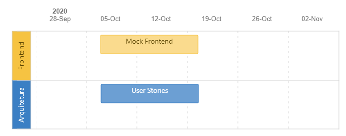

# Requisitos PoP Vote

## Objective

Desenvolver uma aplicação de votação que atenda as etapas de uma eleição: votação, totalização dos votos e divulgação dos resultados. A aplicação precisa prever a identificação e validação da identidade do usuário eleitor. Um usuário administrador cria a eleição e libera a visualização dos votos.

?> Para acessar o processo navegável clique no link:
[PoP-Vote Business process](https://pop-blockchain.github.io/PoPVote/BusinessArchitecture/index.html#list)

## Milestones

 

## Requirements

| Requirement | User Story |
| ----------- | ---------- |
| [Login PoP vote](UserStories/Login.md) | Como usuário quero logar na aplicação usando meu CPF para acessar a eleição |
| Criar conta | Como usuário quero registrar minha wallet para criar uma conta e acessar a eleição. |
| [Buscar candidato](UserStories/BuscarCandidato.md) | Como usuário quero registrar meu voto apenas digitando o numero do candidato |
| [Listar candidato](UserStories/ListarCandidato.md) | Como usuário quero ver a lista de candidatos para selecionar |
| [Registrar voto](UserStories/RegistrarVoto.md) | Como eleitor quero acessar a área de eleição e escolher um cadidato para registrar meu voto. |
| [Exibir Resultado da eleição](UserStories/ExibirResultado.md) | Como eleitor quero consultar o resultado da eleição. |
| [Consultar base de dados da apuração](UserStories/ConsultarApuracao.md) | Como eleitor quero mais transparência na apuração dos votos. |
| Proof of Identity | Como usuário quero poder me identificar para registrar o meu voto de maneira segura. |
| Create election | Como administrador da eleição quero criar uma nova eleição. |
| Register candidates | Como administrador da eleição quero registrar os candidatos na eleição.  |
| Release vote count | Como administrador da eleição quero definar o momento que os eleitores podem votar e o momento do fim da eleição. |
| Release poll | Como administrador da leição quero liberar a relação dos votos da eleição. |

## User interaction and design

 https://cloud.protopie.io/p/52f1a2d77a
